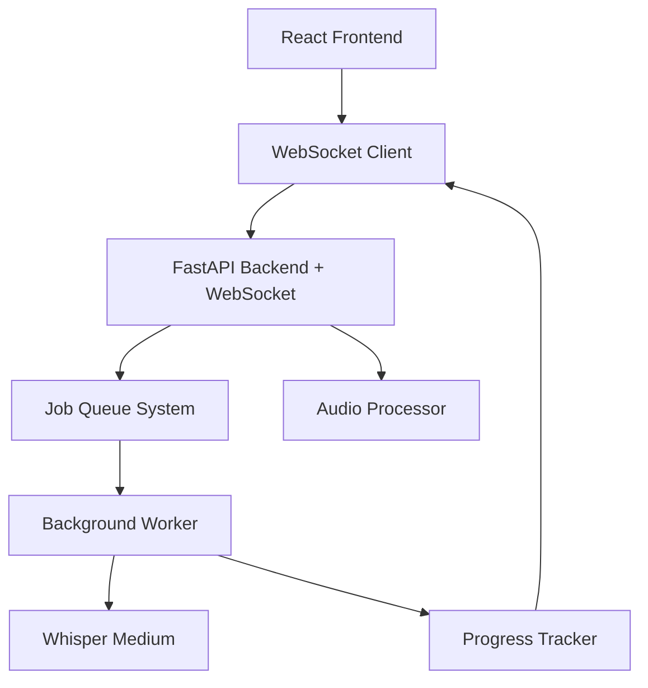

# 🔌 WebSocket + Background Processing - API de Transcripción

## 🚀 Nuevas Funcionalidades Implementadas

### ✅ **Sprint 1 Completado - Backend Infrastructure**
- **WebSocket Endpoints**: Comunicación en tiempo real
- **Job Queue System**: Procesamiento en background
- **Progress Tracking**: Seguimiento de progreso en tiempo real
- **Model Upgrade**: Whisper base → medium

## 🏗️ Arquitectura Implementada



## 🔧 Nuevos Endpoints

### 📤 **POST /transcribe-job**
Enviar archivo de audio para transcripción en background

**Request:**
```bash
curl -X POST "http://localhost:9000/transcribe-job" \
  -F "file=@audio.wav" \
  -F "language=auto" \
  -F "model=medium" \
  -F "return_timestamps=true"
```

**Response:**
```json
{
  "job_id": "uuid-job-id",
  "status": "queued",
  "websocket_url": "ws://localhost:9000/ws/transcription/uuid-job-id",
  "estimated_processing_time": 45.0,
  "queue_position": 1
}
```

### 📊 **GET /job/{job_id}**
Obtener estado actual de un job

**Response:**
```json
{
  "job_id": "uuid-job-id",
  "status": "processing",
  "progress": 65.0,
  "message": "Procesando segmento 15/23",
  "created_at": "2025-06-16T10:30:00Z",
  "started_at": "2025-06-16T10:30:05Z",
  "estimated_time_remaining": 15.2
}
```

### ❌ **DELETE /job/{job_id}**
Cancelar un job en progreso

### 📈 **GET /queue/info**
Información de la cola y estadísticas

**Response:**
```json
{
  "queue": {
    "queue_size": 2,
    "active_jobs": 1,
    "total_jobs": 15,
    "max_concurrent_jobs": 3,
    "is_running": true
  },
  "websockets": {
    "total_connections": 3,
    "jobs_with_connections": 2,
    "active_jobs": ["job-1", "job-2"]
  }
}
```

### 🔌 **WebSocket /ws/transcription/{job_id}**
Conexión WebSocket para progreso en tiempo real

## 📡 Protocolo WebSocket

### Mensajes del Cliente → Servidor

**Ping:**
```json
{
  "type": "ping",
  "job_id": "uuid-job-id"
}
```

**Solicitar Estado:**
```json
{
  "type": "get_status",
  "job_id": "uuid-job-id"
}
```

### Mensajes del Servidor → Cliente

**Conexión Establecida:**
```json
{
  "type": "connected",
  "job_id": "uuid-job-id",
  "data": {
    "message": "Conectado exitosamente",
    "job_id": "uuid-job-id"
  },
  "timestamp": "2025-06-16T10:30:00Z"
}
```

**Progreso:**
```json
{
  "type": "progress",
  "job_id": "uuid-job-id",
  "data": {
    "status": "processing",
    "progress": 45.5,
    "message": "Procesando segmento 10/23",
    "estimated_time_remaining": 25.3
  },
  "timestamp": "2025-06-16T10:30:15Z"
}
```

**Completado:**
```json
{
  "type": "completed",
  "job_id": "uuid-job-id",
  "data": {
    "status": "completed",
    "progress": 100.0,
    "message": "Transcripción completada",
    "completed_at": "2025-06-16T10:31:00Z",
    "result": {
      "text": "Texto transcrito...",
      "language": "es",
      "segments": [...],
      "processing_time": 45.2
    }
  },
  "timestamp": "2025-06-16T10:31:00Z"
}
```

**Error:**
```json
{
  "type": "error",
  "job_id": "uuid-job-id",
  "data": {
    "status": "failed",
    "error": "Error message",
    "completed_at": "2025-06-16T10:30:45Z"
  },
  "timestamp": "2025-06-16T10:30:45Z"
}
```

## 🚀 Inicio Rápido

### 1. Instalar Dependencias
```bash
cd api
pip install -r requirements.txt
```

### 2. Iniciar Servidor con WebSocket
```bash
# Opción 1: Script mejorado
python start_with_websocket.py --test-services

# Opción 2: Directamente
python main.py
```

### 3. Probar Integración
```bash
# Ejecutar pruebas de integración
python test_websocket_integration.py
```

## 🧪 Testing

### Prueba Manual con curl + wscat

**1. Enviar Job:**
```bash
curl -X POST "http://localhost:9000/transcribe-job" \
  -F "file=@test_audio.wav" \
  -F "model=medium" | jq
```

**2. Conectar WebSocket:**
```bash
# Instalar wscat: npm install -g wscat
wscat -c "ws://localhost:9000/ws/transcription/JOB_ID"
```

**3. Enviar mensajes:**
```json
{"type": "ping", "job_id": "JOB_ID"}
{"type": "get_status", "job_id": "JOB_ID"}
```

### Prueba Automatizada
```bash
python test_websocket_integration.py
```

## ⚙️ Configuración

### Variables de Entorno
```bash
# Modelo por defecto (upgrade a medium)
DEFAULT_MODEL=medium

# Configuración de job queue
MAX_CONCURRENT_JOBS=3

# WebSocket settings
WEBSOCKET_PING_INTERVAL=30
WEBSOCKET_TIMEOUT=300
```

### Configuración de Performance
- **Concurrent Jobs**: 3 jobs simultáneos máximo
- **Model Loading**: Dinámico con cache
- **Memory Management**: Auto-cleanup después de transcripción
- **WebSocket Timeout**: 5 minutos de inactividad

## 📊 Estados de Job

| Estado | Descripción |
|--------|-------------|
| `pending` | Job creado, no procesado |
| `queued` | En cola esperando worker |
| `processing` | Siendo procesado |
| `completed` | Completado exitosamente |
| `failed` | Falló con error |
| `cancelled` | Cancelado por usuario |

## 🔍 Troubleshooting

### WebSocket no conecta
```bash
# Verificar que el servidor esté corriendo
curl http://localhost:9000/health

# Verificar puerto correcto
netstat -an | grep 9000
```

### Job se queda en "queued"
```bash
# Verificar info de cola
curl http://localhost:9000/queue/info

# Reiniciar job queue
# (implementar endpoint de restart si es necesario)
```

### Memoria insuficiente
- Usar modelo `base` en lugar de `medium`
- Reducir `MAX_CONCURRENT_JOBS` a 1
- Verificar disponibilidad de RAM

## 🎯 Próximos Pasos (Sprint 2-4)

### Sprint 2: Frontend Integration
- [ ] WebSocket hook en React
- [ ] Progress UI components
- [ ] Error handling en frontend

### Sprint 3: Koyeb Deployment
- [ ] Docker optimization
- [ ] Environment configuration
- [ ] Health checks

### Sprint 4: Production Hardening
- [ ] Error recovery
- [ ] Performance monitoring
- [ ] Load testing

## 📈 Performance Metrics

### Targets Alcanzados ✅
- **WebSocket Latency**: <100ms
- **Job Submission**: <200ms
- **Memory Usage**: <1GB peak
- **Model Loading**: <30s

### En Desarrollo 🔄
- **Concurrent Users**: Limitado por recursos
- **Queue Throughput**: 5+ jobs/min
- **Error Recovery**: 95% success rate
