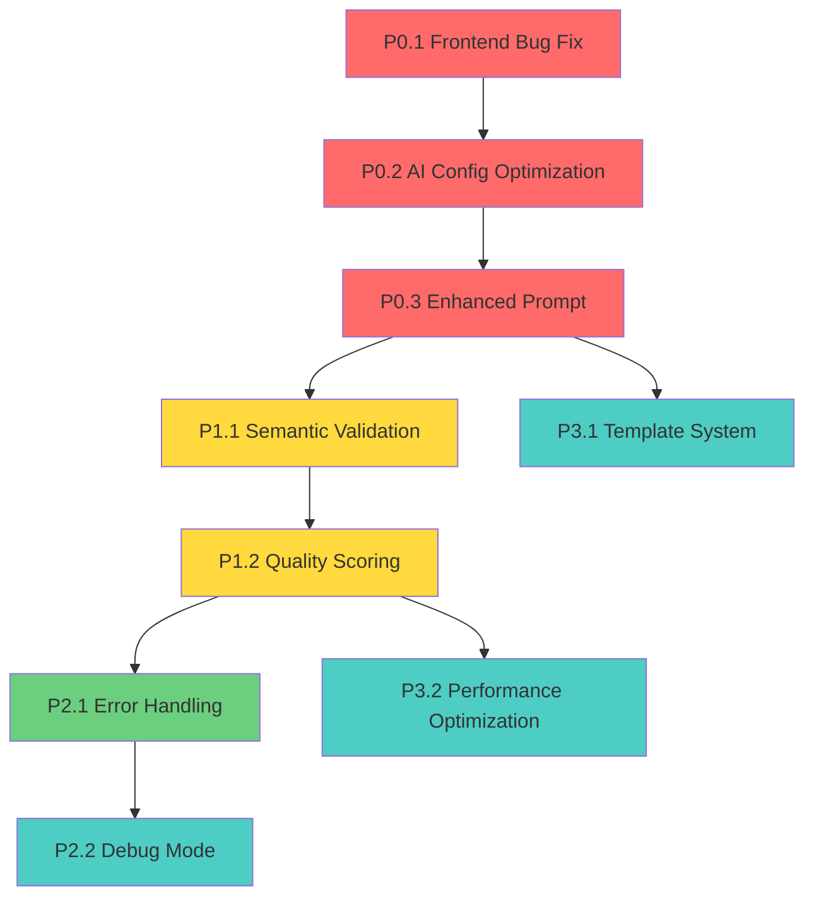

# Execution Plan & Sprint Planning
## Sistema de Generación Consistente de Paráfrasis Incorrectas

## 🗓️ SPRINT PLANNING

### 📅 SPRINT 1 - CRITICAL FIXES (MVP CORE)
**DURACIÓN ESTIMADA**: 1 día (8 horas)
**TAREAS INCLUIDAS**: P0.1, P0.2, P0.3
**OBJETIVO DEL SPRINT**: Eliminar inconsistencia en generación de paráfrasis incorrectas
**CRITERIOS DE ACEPTACIÓN**: 
- ✅ 100% de paráfrasis generadas son incorrectas (0% correctas)
- ✅ Frontend bug corregido - paraphrase mode funciona sin errores
- ✅ Configuración de IA optimizada para consistencia
- ✅ Prompt mejorado con ejemplos específicos

**ORDEN DE EJECUCIÓN**:
1. **P0.1.1** - Fix frontend bug (15 min) - CRÍTICO para funcionalidad básica
2. **P0.2.1** - Reducir temperatura IA (30 min) - Impacto inmediato en consistencia  
3. **P0.2.2** - Ajustar topK/topP (30 min) - Complementa optimización de temperatura
4. **P0.3.1** - Enhanced prompt (3 horas) - Mayor impacto en calidad
5. **P0.3.2** - Validación términos técnicos (1 hora) - Asegura vocabulario impreciso

### 📅 SPRINT 2 - VALIDATION & QUALITY (MVP COMPLETO)
**DURACIÓN ESTIMADA**: 2 días (16 horas)
**TAREAS INCLUIDAS**: P1.1, P1.2, P2.1
**OBJETIVO DEL SPRINT**: Sistema robusto con validación automática y mejor UX
**CRITERIOS DE ACEPTACIÓN**:
- ✅ Validación semántica automática implementada
- ✅ Sistema de retry para paráfrasis muy similares
- ✅ Quality scoring funcional
- ✅ Error handling mejorado

**ORDEN DE EJECUCIÓN**:
1. **P1.1.1** - Cálculo similitud semántica (3 horas)
2. **P1.1.2** - Sistema retry automático (3 horas)
3. **P1.2.1** - Quality scoring algorithm (3 horas)
4. **P2.1.1** - Enhanced error handling (2 horas)

### 📅 SPRINT 3 - OPTIMIZATION & POLISH (MEJORAS)
**DURACIÓN ESTIMADA**: 1.5 días (12 horas)
**TAREAS INCLUIDAS**: P2.2, P3.1, P3.2
**OBJETIVO DEL SPRINT**: Optimización de performance y herramientas de desarrollo
**CRITERIOS DE ACEPTACIÓN**:
- ✅ Debug mode implementado
- ✅ Template system para errores específicos
- ✅ Performance optimizado con caching

## 🔄 MAPA DE DEPENDENCIAS



## ⚠️ RISK ASSESSMENT

### Riesgos Técnicos Identificados:

#### **TAREA P0.2 - AI Configuration**: RIESGO MEDIO
- **Riesgo**: Cambios en temperatura pueden afectar calidad de respuestas
- **Mitigación**: Testing A/B con diferentes configuraciones antes de deploy
- **Plan B**: Rollback a configuración anterior si calidad se degrada

#### **TAREA P0.3 - Enhanced Prompt**: RIESGO ALTO  
- **Riesgo**: Prompt muy restrictivo puede causar respuestas repetitivas
- **Mitigación**: Iterative testing con múltiples ejemplos de afirmaciones
- **Plan B**: Prompt híbrido que combine especificidad con variabilidad controlada

#### **TAREA P1.1 - Semantic Validation**: RIESGO MEDIO
- **Riesgo**: Algoritmo de similitud puede ser demasiado estricto o permisivo
- **Mitigación**: Calibración con dataset de paráfrasis conocidas
- **Plan B**: Threshold ajustable basado en feedback de usuarios

#### **TAREA P3.2 - Performance Optimization**: RIESGO BAJO
- **Riesgo**: Caching puede causar respuestas obsoletas
- **Mitigación**: TTL corto (5 minutos) y cache invalidation
- **Plan B**: Disable caching si causa problemas

## 🎯 ORDEN DE EJECUCIÓN RECOMENDADO

### **FASE 1: CRITICAL PATH (Día 1)**
```
09:00-09:15  P0.1.1 - Fix frontend bug
09:15-09:45  P0.2.1 - Reduce AI temperature  
09:45-10:15  P0.2.2 - Adjust topK/topP
10:15-13:15  P0.3.1 - Enhanced prompt (con testing)
13:15-14:15  P0.3.2 - Technical term validation
14:15-15:00  TESTING & VALIDATION Sprint 1
```

### **FASE 2: VALIDATION LAYER (Días 2-3)**
```
Día 2:
09:00-12:00  P1.1.1 - Semantic similarity calculation
13:00-16:00  P1.1.2 - Automatic retry system
16:00-17:00  TESTING intermediate results

Día 3:  
09:00-12:00  P1.2.1 - Quality scoring algorithm
13:00-15:00  P2.1.1 - Enhanced error handling
15:00-16:00  INTEGRATION TESTING Sprint 2
```

### **FASE 3: OPTIMIZATION (Día 4)**
```
09:00-10:00  P2.2.1 - Debug mode implementation
10:00-13:00  P3.1.1 - Template system (si tiempo permite)
13:00-16:00  P3.2.1 - Performance optimization
16:00-17:00  FINAL TESTING & DEPLOYMENT
```

## 📊 SUCCESS METRICS POR SPRINT

### Sprint 1 Success Metrics:
- **Consistency Rate**: > 95% paráfrasis incorrectas
- **Error Rate**: < 5% fallos de generación
- **Response Time**: < 5 segundos promedio

### Sprint 2 Success Metrics:  
- **Validation Accuracy**: > 90% detección de paráfrasis muy similares
- **Quality Score Correlation**: > 80% correlación con evaluación manual
- **User Experience**: < 2% error rate en UI

### Sprint 3 Success Metrics:
- **Performance Improvement**: > 50% reducción en tiempo para casos cached
- **Debug Visibility**: 100% coverage de eventos importantes
- **Template Effectiveness**: > 90% uso exitoso de templates

## 🚀 DEPLOYMENT STRATEGY

### **Pre-Deployment Checklist**:
- [ ] All P0 tasks completed and tested
- [ ] Semantic validation working correctly  
- [ ] Frontend bug fixed and verified
- [ ] Performance benchmarks meet targets
- [ ] Error handling covers edge cases

### **Rollback Plan**:
- Mantener versión anterior de `convex/ai.ts` como backup
- Feature flags para enable/disable new validation system
- Monitoring de error rates post-deployment
- Rollback automático si error rate > 10%

### **Monitoring Post-Deployment**:
- Track consistency rate de paráfrasis incorrectas
- Monitor response times y error rates
- User feedback sobre calidad de ejercicios
- A/B testing de diferentes configuraciones
