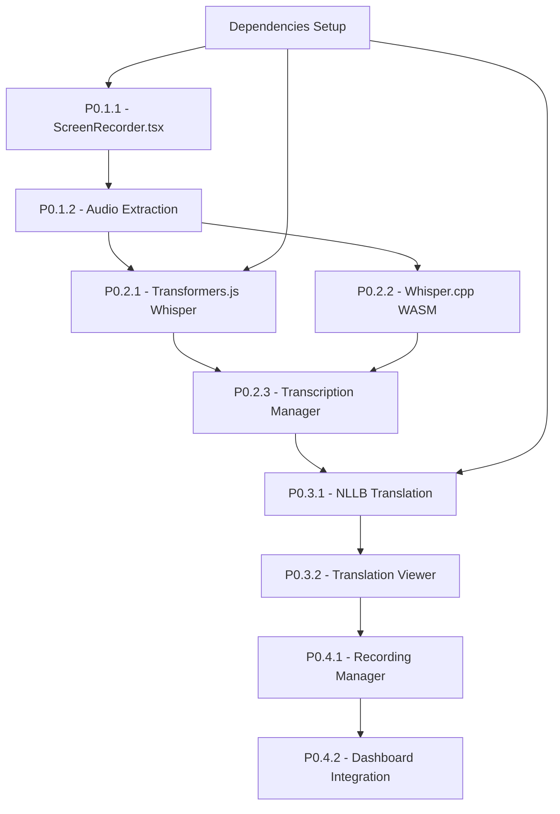

# Execution Plan & Sprint Planning - Sistema de Grabación y Transcripción 100% Local

## 🗓️ SPRINT PLANNING

### 📅 SPRINT 1 (CORE RECORDING - Semana 1-2)
**TAREAS INCLUIDAS**: [P0.1 - ScreenRecorder Component]
**OBJETIVO DEL SPRINT**: Implementar grabación de pantalla con extracción de audio
**CRITERIOS DE ACEPTACIÓN**: 
- ✅ Grabar pantalla con audio del sistema (10-20 min)
- ✅ Extraer audio de grabación de video
- ✅ UI intuitiva para controles de grabación
- ✅ Manejo de errores y permisos
**DURACIÓN ESTIMADA**: 2 semanas
**DEPENDENCIAS TÉCNICAS**:
- MediaRecorder API
- getDisplayMedia() con audio constraints
- Web Audio API para extracción
- File API para manejo de blobs

### 📅 SPRINT 2 (TRANSCRIPTION ENGINE - Semana 3-4)
**TAREAS INCLUIDAS**: [P0.2 - Transcription Engine Local]
**OBJETIVO DEL SPRINT**: Implementar transcripción 100% local con Whisper
**CRITERIOS DE ACEPTACIÓN**:
- ✅ Transcripción con Transformers.js + Whisper (modo estándar)
- ✅ Transcripción con Whisper.cpp + WASM (modo ultra-rápido)
- ✅ UI para seleccionar modo y mostrar progreso
- ✅ Manejo de archivos largos (chunking)
- ✅ Cache de modelos en IndexedDB
**DURACIÓN ESTIMADA**: 2 semanas
**DEPENDENCIAS TÉCNICAS**:
- `@xenova/transformers` v3+
- Whisper.cpp precompilado a WASM
- Web Workers para procesamiento
- IndexedDB para cache

### 📅 SPRINT 3 (TRANSLATION & INTEGRATION - Semana 5-6)
**TAREAS INCLUIDAS**: [P0.3 - Translation Engine Local, P0.4 - Integration]
**OBJETIVO DEL SPRINT**: Traducción local e integración completa
**CRITERIOS DE ACEPTACIÓN**:
- ✅ Traducción con NLLB (200+ idiomas)
- ✅ UI para mostrar original y traducción
- ✅ Integración completa en Dashboard
- ✅ Flujo end-to-end funcional
- ✅ Export en múltiples formatos
**DURACIÓN ESTIMADA**: 2 semanas
**DEPENDENCIAS TÉCNICAS**:
- `Xenova/nllb-200-distilled-600M`
- Translation pipeline con Transformers.js
- Zustand para estado global
- File export utilities

## 🔄 MAPA DE DEPENDENCIAS



## ⚠️ RISK ASSESSMENT

### Riesgos Técnicos Identificados:

#### **RIESGO P0.1**: MediaRecorder API Compatibility
- **Descripción**: Compatibilidad limitada en algunos navegadores para captura de audio del sistema
- **Probabilidad**: Media
- **Impacto**: Alto
- **Mitigación**: 
  - Detección de features del navegador
  - Fallback a grabación solo de pantalla
  - Documentación clara de requisitos

#### **RIESGO P0.2**: Model Loading Performance
- **Descripción**: Modelos AI grandes (600MB+) pueden tardar en cargar
- **Probabilidad**: Alta
- **Impacto**: Medio
- **Mitigación**:
  - Progressive loading con indicadores
  - Cache inteligente en IndexedDB
  - Modelos quantizados más pequeños
  - Lazy loading de modelos

#### **RIESGO P0.3**: Memory Usage con Archivos Largos
- **Descripción**: Procesamiento de audio de 20 min puede consumir mucha RAM
- **Probabilidad**: Media
- **Impacto**: Alto
- **Mitigación**:
  - Chunking de audio en segmentos
  - Web Workers para procesamiento
  - Garbage collection explícito
  - Límites de tamaño de archivo

#### **RIESGO P0.4**: Browser Security Restrictions
- **Descripción**: Políticas CORS y permisos pueden bloquear funcionalidades
- **Probabilidad**: Media
- **Impacto**: Alto
- **Mitigación**:
  - HTTPS obligatorio para MediaRecorder
  - Manejo de permisos explícito
  - Error handling robusto

## 🎯 ORDEN DE EJECUCIÓN RECOMENDADO

### **FASE 1: SETUP & DEPENDENCIES (Día 1-2)**
1. **Instalar dependencias core**:
   ```bash
   npm install @xenova/transformers
   npm install zustand
   ```
2. **Configurar Web Workers**
3. **Setup HTTPS para desarrollo**
4. **Configurar Vite para WASM**

### **FASE 2: RECORDING CORE (Día 3-7)**
1. **P0.1.1**: Implementar ScreenRecorder component
2. **P0.1.2**: Audio extraction service
3. **Testing**: Grabaciones de 10-20 min

### **FASE 3: TRANSCRIPTION ENGINE (Día 8-14)**
1. **P0.2.1**: Transformers.js + Whisper integration
2. **P0.2.2**: Whisper.cpp + WASM (opcional para MVP)
3. **P0.2.3**: Transcription Manager UI
4. **Testing**: Transcripción de audios largos

### **FASE 4: TRANSLATION & INTEGRATION (Día 15-21)**
1. **P0.3.1**: NLLB translation service
2. **P0.3.2**: Translation viewer UI
3. **P0.4.1**: Recording Manager orchestration
4. **P0.4.2**: Dashboard integration
5. **Testing**: Flujo completo end-to-end

## 📊 MÉTRICAS DE ÉXITO

### Performance Targets:
- **Model Loading**: < 30 segundos para primer uso
- **Transcription Speed**: 1x-2x tiempo real (10 min audio → 5-10 min procesamiento)
- **Translation Speed**: < 5 segundos para textos de 1000 palabras
- **Memory Usage**: < 2GB RAM para archivos de 20 min
- **Accuracy**: >90% precisión en transcripción (idiomas principales)

### User Experience Targets:
- **Setup Time**: < 2 minutos para primer uso
- **Error Rate**: < 5% fallos en grabación
- **Export Success**: 100% éxito en exportación
- **Browser Support**: Chrome 90+, Firefox 88+, Safari 14+

## 🛠️ STACK TECNOLÓGICO FINAL

### **Frontend Core**:
- React 19 + TypeScript
- Vite 6.2.0 con plugins WASM
- Tailwind CSS
- Zustand para estado global

### **AI & Processing**:
- `@xenova/transformers` v3+ (Whisper + NLLB)
- `whisper.cpp` compilado a WASM (opcional)
- Web Workers para procesamiento
- IndexedDB para cache de modelos

### **Audio & Video**:
- MediaRecorder API
- getDisplayMedia() API
- Web Audio API
- File API

### **Storage & Export**:
- IndexedDB para cache local
- Blob API para archivos temporales
- JSON/TXT/SRT export utilities

## 🚀 COMANDOS DE SETUP RÁPIDO

```bash
# 1. Instalar dependencias AI
npm install @xenova/transformers

# 2. Instalar estado global
npm install zustand

# 3. Configurar desarrollo HTTPS (requerido para MediaRecorder)
npm install --save-dev @vitejs/plugin-basic-ssl

# 4. Actualizar vite.config.ts para WASM support
# (Ver configuración en documentación técnica)
```

## 📋 CHECKLIST DE IMPLEMENTACIÓN

### Sprint 1 - Recording:
- [ ] MediaRecorder API setup
- [ ] Screen capture con audio
- [ ] Audio extraction service
- [ ] Error handling y permisos
- [ ] UI básica de grabación

### Sprint 2 - Transcription:
- [ ] Transformers.js integration
- [ ] Whisper model loading
- [ ] Chunking para archivos largos
- [ ] Progress indicators
- [ ] Cache de modelos

### Sprint 3 - Translation & Integration:
- [ ] NLLB translation pipeline
- [ ] Translation viewer UI
- [ ] Dashboard integration
- [ ] Export functionality
- [ ] Testing end-to-end

## 🎉 ENTREGABLES FINALES

1. **ScreenRecorder Component** - Grabación de pantalla + audio
2. **TranscriptionEngine** - Whisper local (2 modos)
3. **TranslationEngine** - NLLB local (200+ idiomas)
4. **RecordingManager** - Orquestación completa
5. **Dashboard Integration** - Integración fluida
6. **Export System** - TXT, JSON, SRT formats
7. **Documentation** - Guía de usuario y técnica
