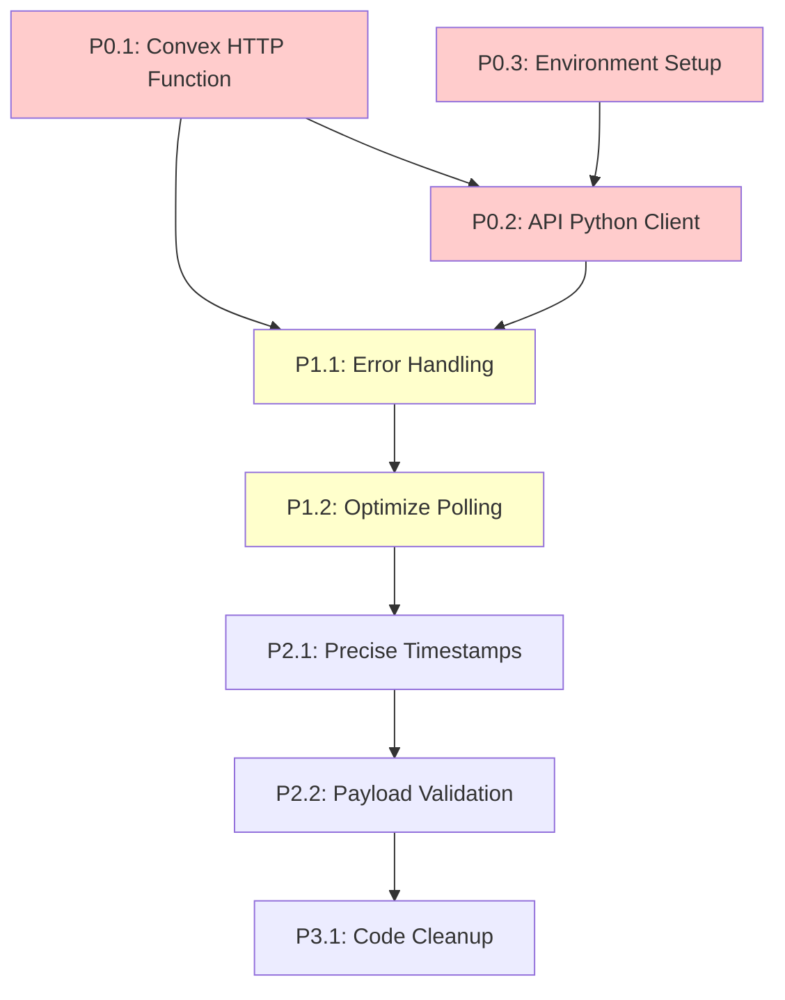

# Execution Plan & Sprint Planning
## Sistema de Transcripción Persistente - Sincronización API ↔ Convex

## 🗓️ SPRINT PLANNING

### 📅 SPRINT 1 - SINCRONIZACIÓN CORE (MVP CRÍTICO)
**DURACIÓN ESTIMADA**: 1-2 días
**OBJETIVO DEL SPRINT**: Implementar sincronización básica API → Convex que resuelva el problema de desincronización
**TAREAS INCLUIDAS**: P0.1, P0.2, P0.3

#### Criterios de Aceptación Sprint 1:
- ✅ Jobs completados en API se reflejan automáticamente en Convex
- ✅ Dashboard muestra estado correcto (no más "1 transcripción en progreso")
- ✅ Sincronización funciona en happy path (sin errores de red)
- ✅ Autenticación API ↔ Convex configurada correctamente

#### Entregables Sprint 1:
1. **Convex HTTP Function**: `updateTranscriptionJob` endpoint funcional
2. **API Python Client**: `ConvexClient` service integrado en job queue
3. **Environment Setup**: Variables de entorno y API key configurados
4. **Integration Test**: Flujo completo transcripción → sync → UI actualizada

### 📅 SPRINT 2 - ROBUSTEZ Y OPTIMIZACIÓN
**DURACIÓN ESTIMADA**: 1 día
**OBJETIVO DEL SPRINT**: Agregar manejo de errores y optimizar performance
**TAREAS INCLUIDAS**: P1.1, P1.2

#### Criterios de Aceptación Sprint 2:
- ✅ Reintentos automáticos cuando falla sincronización
- ✅ Logging detallado de operaciones de sync
- ✅ Polling reducido de 2s a 10s (80% menos requests)
- ✅ Fallback a polling si sync falla completamente

#### Entregables Sprint 2:
1. **Error Handling**: Retry logic con 3 intentos
2. **Performance**: Polling optimizado y menos frecuente
3. **Monitoring**: Logs estructurados para debugging
4. **Resilience**: Sistema funciona aunque sync falle ocasionalmente

### 📅 SPRINT 3 - MEJORAS Y CLEANUP
**DURACIÓN ESTIMADA**: 0.5 días
**OBJETIVO DEL SPRINT**: Pulir implementación y limpiar código legacy
**TAREAS INCLUIDAS**: P2.1, P2.2, P3.1

#### Criterios de Aceptación Sprint 3:
- ✅ Timestamps precisos en toda la aplicación
- ✅ Validación robusta de payloads
- ✅ Código legacy removido (WebSockets, etc.)
- ✅ Documentación actualizada

## 🔄 MAPA DE DEPENDENCIAS

## ⚠️ RISK ASSESSMENT

### Riesgos Técnicos por Sprint:

#### SPRINT 1 - Riesgos Críticos:
- **RIESGO P0.1**: Convex HTTP functions no funcionan como esperado
  - **PROBABILIDAD**: Baja (tecnología madura)
  - **IMPACTO**: Alto (bloquea MVP)
  - **MITIGACIÓN**: Probar con endpoint simple primero, documentación Convex

- **RIESGO P0.2**: Problemas de autenticación API ↔ Convex
  - **PROBABILIDAD**: Media (configuración compleja)
  - **IMPACTO**: Alto (bloquea comunicación)
  - **MITIGACIÓN**: Generar API key correctamente, probar auth por separado

- **RIESGO P0.3**: Variables de entorno mal configuradas
  - **PROBABILIDAD**: Media (error humano)
  - **IMPACTO**: Medio (fácil de debuggear)
  - **MITIGACIÓN**: Validar configuración al inicio, logging detallado

#### SPRINT 2 - Riesgos de Performance:
- **RIESGO P1.2**: Polling muy lento causa UX pobre
  - **PROBABILIDAD**: Baja (10s es razonable)
  - **IMPACTO**: Medio (UX degradada)
  - **MITIGACIÓN**: A/B test con diferentes intervalos, mantener 2s como fallback

#### SPRINT 3 - Riesgos de Regresión:
- **RIESGO P3.1**: Cleanup rompe funcionalidad existente
  - **PROBABILIDAD**: Baja (cambios menores)
  - **IMPACTO**: Medio (regresión funcional)
  - **MITIGACIÓN**: Testing exhaustivo antes de cleanup, commits pequeños

## 🎯 ORDEN DE EJECUCIÓN RECOMENDADO

### FASE 1: FUNDACIÓN (Día 1 - Mañana)
1. **P0.3.1**: Generar API key en Convex (15 min)
2. **P0.3.2**: Configurar variables de entorno (15 min)
3. **P0.1.1**: Crear función HTTP updateTranscriptionJobFromAPI (2 horas)
4. **P0.1.2**: Implementar función interna updateFromAPI (1 hora)

### FASE 2: INTEGRACIÓN (Día 1 - Tarde)
5. **P0.2.1**: Crear ConvexClient service (2 horas)
6. **P0.2.2**: Integrar ConvexClient en job_queue_service (1 hora)
7. **TESTING**: Prueba de integración end-to-end (1 hora)

### FASE 3: ROBUSTEZ (Día 2 - Mañana)
8. **P1.1.1**: Implementar retry logic (1.5 horas)
9. **P1.1.2**: Agregar logging detallado (1 hora)
10. **P1.2.1**: Optimizar polling interval (30 min)
11. **P1.2.2**: Implementar fallback logic (1 hora)

### FASE 4: PULIDO (Día 2 - Tarde)
12. **P2.1.1**: Sincronizar timestamps precisos (1 hora)
13. **P2.2.1**: Validar payload en Convex (30 min)
14. **P3.1.1**: Cleanup código legacy (30 min)
15. **TESTING FINAL**: Validación completa del sistema (1 hora)

## 📊 MÉTRICAS DE ÉXITO POR SPRINT

### Sprint 1 Metrics:
- **Sync Success Rate**: > 95% en happy path
- **Latency**: < 2 segundos desde job completion hasta UI update
- **Error Rate**: < 5% (solo errores de red esperados)

### Sprint 2 Metrics:
- **Retry Success Rate**: > 90% después de reintentos
- **Polling Reduction**: 80% menos requests (de 30/min a 6/min)
- **Error Recovery**: < 10 segundos para detectar y recuperar de fallos

### Sprint 3 Metrics:
- **Code Quality**: 0 warnings de linting
- **Performance**: No regresión en tiempo de respuesta
- **Timestamp Accuracy**: < 100ms diferencia entre API y UI

## 🚀 DEPLOYMENT STRATEGY

### Estrategia de Despliegue Incremental:
1. **Deploy Convex Functions**: Sin impacto en producción
2. **Deploy API Changes**: Con feature flag para sync
3. **Enable Sync**: Gradualmente para usuarios beta
4. **Full Rollout**: Después de validación exitosa

### Rollback Plan:
- **Convex**: Revertir función HTTP (sin impacto)
- **API**: Deshabilitar sync calls (mantener funcionalidad actual)
- **Frontend**: Mantener polling como estaba (sin cambios necesarios)

## 📋 CHECKLIST DE COMPLETITUD

### Pre-Sprint Checklist:
- [ ] Acceso a Convex dashboard para generar API key
- [ ] Entorno de desarrollo con API y frontend funcionando
- [ ] Documentación de Convex HTTP functions revisada
- [ ] Plan de testing definido

### Post-Sprint Checklist:
- [ ] Sincronización funciona en desarrollo
- [ ] Logs muestran sync exitoso
- [ ] UI actualizada correctamente
- [ ] Performance mejorada (menos polling)
- [ ] Documentación actualizada
- [ ] Código legacy removido
