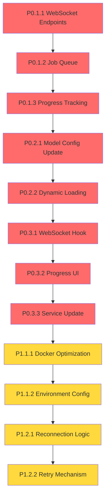

# Execution Plan & Sprint Planning
# Retender - Audio Transcription System Upgrade

## 🗓️ SPRINT PLANNING

### 📅 SPRINT 1 - Backend Infrastructure (MVP CORE)
**DURACIÓN**: 3-4 días
**TAREAS INCLUIDAS**: P0.1 (WebSocket + Job Queue)
**OBJETIVO DEL SPRINT**: Sistema de procesamiento en background funcional
**CRITERIOS DE ACEPTACIÓN**: 
- ✅ WebSocket endpoints funcionando
- ✅ Job queue procesando trabajos en background
- ✅ Progress updates en tiempo real
- ✅ Basic error handling

**DELIVERABLES**:
- WebSocket endpoints en FastAPI
- Job queue system con asyncio
- Progress tracking básico
- Integration tests pasando

### 📅 SPRINT 2 - Model Upgrade (MVP CORE)
**DURACIÓN**: 2-3 días  
**TAREAS INCLUIDAS**: P0.2 (Whisper Medium Integration)
**OBJETIVO DEL SPRINT**: Upgrade exitoso a whisper-medium
**CRITERIOS DE ACEPTACIÓN**:
- ✅ Whisper medium cargando correctamente
- ✅ Memory usage <1GB peak
- ✅ Transcription accuracy mejorada vs base
- ✅ Dynamic model loading funcionando

**DELIVERABLES**:
- Model configuration actualizada
- Memory optimization implementada
- Performance benchmarks
- Model loading/unloading tests

### 📅 SPRINT 3 - Frontend Integration (MVP COMPLETO)
**DURACIÓN**: 3-4 días
**TAREAS INCLUIDAS**: P0.3 (Frontend WebSocket + UI)
**OBJETIVO DEL SPRINT**: Frontend completamente integrado con backend
**CRITERIOS DE ACEPTACIÓN**:
- ✅ WebSocket client funcionando
- ✅ Progress bar en tiempo real
- ✅ Error states manejados
- ✅ Full user flow funcional

**DELIVERABLES**:
- useWebSocket hook
- Progress UI components
- Updated transcription service
- End-to-end integration tests

### 📅 SPRINT 4 - Deployment & Optimization (PRODUCCIÓN)
**DURACIÓN**: 2-3 días
**TAREAS INCLUIDAS**: P1.1 (Koyeb Deployment) + P1.2 (Error Handling)
**OBJETIVO DEL SPRINT**: Sistema deployado y robusto en producción
**CRITERIOS DE ACEPTACIÓN**:
- ✅ Deployed en Koyeb free tier
- ✅ Health checks pasando
- ✅ Error recovery funcionando
- ✅ Performance targets alcanzados

**DELIVERABLES**:
- Docker optimizado para Koyeb
- Environment configuration
- Monitoring y health checks
- Production deployment

## 🔄 MAPA DE DEPENDENCIAS

## ⚠️ RISK ASSESSMENT

### Riesgos Técnicos Identificados:

#### **TAREA P0.1 - WebSocket Infrastructure**
- **RIESGO**: WebSocket connections inestables en Koyeb
- **PROBABILIDAD**: Media
- **IMPACTO**: Alto
- **MITIGACIÓN**: Implementar robust reconnection logic + fallback a polling

#### **TAREA P0.2 - Whisper Medium**
- **RIESGO**: Memory constraints en Koyeb free tier
- **PROBABILIDAD**: Alta
- **IMPACTO**: Crítico
- **MITIGACIÓN**: Dynamic model loading + fallback a base model si necesario

#### **TAREA P1.1 - Koyeb Deployment**
- **RIESGO**: Free tier limitations más restrictivas de lo esperado
- **PROBABILIDAD**: Media
- **IMPACTO**: Alto
- **MITIGACIÓN**: Docker optimization agresiva + model size reduction

#### **TAREA P0.3 - Frontend Integration**
- **RIESGO**: WebSocket browser compatibility issues
- **PROBABILIDAD**: Baja
- **IMPACTO**: Medio
- **MITIGACIÓN**: Polyfills + fallback mechanisms

## 🎯 ORDEN DE EJECUCIÓN RECOMENDADO

### **FASE 1: BACKEND FOUNDATION (Días 1-4)**
1. **P0.1.1**: WebSocket Endpoints Implementation
2. **P0.1.2**: Job Queue System  
3. **P0.1.3**: Progress Tracking System
4. **Integration Testing**: Backend flow completo

### **FASE 2: MODEL UPGRADE (Días 5-7)**
1. **P0.2.1**: Model Configuration Update
2. **P0.2.2**: Dynamic Model Loading
3. **Performance Testing**: Memory usage + accuracy benchmarks

### **FASE 3: FRONTEND INTEGRATION (Días 8-11)**
1. **P0.3.1**: WebSocket Hook Implementation
2. **P0.3.2**: Progress UI Components
3. **P0.3.3**: Transcription Service Update
4. **End-to-End Testing**: Full user flow

### **FASE 4: DEPLOYMENT & HARDENING (Días 12-14)**
1. **P1.1.1**: Docker Multi-stage Build
2. **P1.1.2**: Environment Configuration
3. **P1.2.1**: WebSocket Reconnection Logic
4. **P1.2.2**: Job Retry Mechanism
5. **Production Deployment**: Koyeb deployment + monitoring

## 📊 SUCCESS METRICS POR SPRINT

### Sprint 1 Metrics:
- WebSocket connection success rate: >99%
- Job queue throughput: >5 concurrent jobs
- Progress update latency: <100ms
- Memory usage: <500MB for infrastructure

### Sprint 2 Metrics:
- Model loading time: <30s
- Peak memory usage: <1GB
- Transcription accuracy: >95% (vs >90% base)
- Model swap time: <10s

### Sprint 3 Metrics:
- Frontend bundle size increase: <500KB
- UI responsiveness: <16ms render time
- WebSocket reconnection time: <5s
- Error recovery success rate: >95%

### Sprint 4 Metrics:
- Deployment success rate: 100%
- Health check response time: <200ms
- Production uptime: >99%
- End-to-end latency: <2x processing time

## 🔧 DEVELOPMENT ENVIRONMENT SETUP

### Prerequisites:
- Python 3.10+
- Node.js 18+
- Docker & Docker Compose
- Koyeb CLI (para deployment)

### Local Development Flow:
1. **Backend**: `cd api && python start.py --reload`
2. **Frontend**: `npm run dev`
3. **Testing**: Integration tests con ambos servicios corriendo
4. **Docker Testing**: `docker-compose up` para simular producción

### CI/CD Pipeline:
1. **PR Creation**: Automated tests + linting
2. **Merge to main**: Build Docker image
3. **Manual Deploy**: Deploy a Koyeb staging
4. **Production Deploy**: Manual promotion después de testing

## 📋 DEFINITION OF DONE

### Para cada tarea:
- ✅ Código implementado y reviewed
- ✅ Unit tests escritos y pasando
- ✅ Integration tests pasando
- ✅ Performance benchmarks dentro de targets
- ✅ Error handling implementado
- ✅ Documentation actualizada
- ✅ Manual testing completado

### Para cada sprint:
- ✅ Todos los criterios de aceptación cumplidos
- ✅ Demo funcional preparada
- ✅ Performance metrics alcanzados
- ✅ No regressions en funcionalidad existente
- ✅ Code coverage >80%
- ✅ Security review completado
