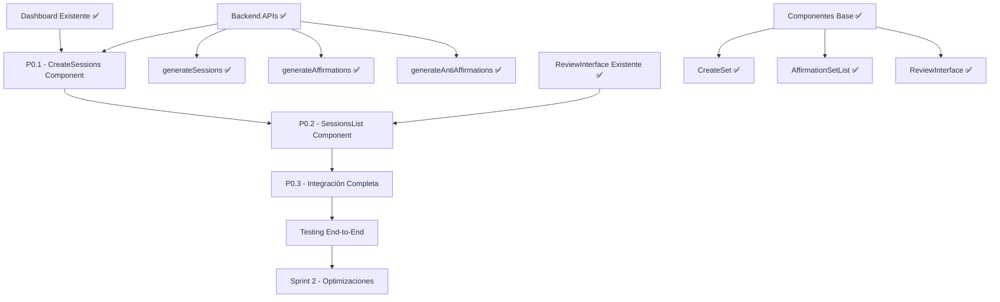

# Execution Plan & Sprint Planning - Sistema de Sesiones Inteligentes

## 🗓️ SPRINT PLANNING

### 📅 SPRINT 1 (SESIONES INTELIGENTES MVP) - ✅ COMPLETADO
**TAREAS INCLUIDAS**: P0.1, P0.2, P0.3
**OBJETIVO DEL SPRINT**: Implementar frontend completo del Sistema de Sesiones Inteligentes
**CRITERIOS DE ACEPTACIÓN**:
- ✅ Usuario puede generar múltiples sesiones desde texto extenso
- ✅ Interface muestra sesiones agrupadas por tema
- ✅ Navegación completa entre CreateSessions → SessionsList → ReviewInterface
- ✅ Flujo de práctica funciona con sessions data
- ✅ Manejo de errores y loading states implementado
**DURACIÓN REAL**: 1 día (más rápido de lo estimado)

### 📅 SPRINT ANTERIOR (REBRANDING) - ✅ COMPLETADO
**TAREAS INCLUIDAS**: P0.4, P0.5, P0.6, P0.7
**OBJETIVO DEL SPRINT**: Rebranding completo de Kioku a Retender + eliminación de grabación de pantalla
**CRITERIOS DE ACEPTACIÓN**:
- ✅ Aplicación muestra "Retender" en lugar de "Kioku"
- ✅ Título del navegador actualizado
- ✅ Metadatos SEO completos
- ✅ Configuración del proyecto actualizada
- ✅ Funcionalidad de grabación de pantalla eliminada
- ✅ Aplicación funciona sin errores
**DURACIÓN ESTIMADA**: 1 día ✅ COMPLETADO

**RESULTADOS OBTENIDOS**:
- ✅ UI principal actualizada con nombre "Retender"
- ✅ Ícono temporal "R" implementado
- ✅ HTML title cambiado a "Retender"
- ✅ Metadatos Open Graph y Twitter Cards completos
- ✅ Package.json actualizado a "retender"
- ✅ README.md con nueva identidad
- ✅ Funcionalidad de screen recording completamente eliminada
- ✅ Dashboard simplificado con 2 acciones principales
- ✅ Schema de base de datos limpio sin tabla recordings
- ✅ Aplicación funcionando en http://localhost:5173/

### 📅 SPRINT 2 (MEJORAS VISUALES) - FUTURO
**TAREAS INCLUIDAS**: P1.1, P1.2
**OBJETIVO DEL SPRINT**: Mejorar identidad visual con logo y favicon profesionales
**CRITERIOS DE ACEPTACIÓN**: 
- Logo SVG profesional implementado
- Favicon personalizado en múltiples formatos
- Diseño responsive mantenido
**DURACIÓN ESTIMADA**: 2-3 días

### 📅 SPRINT 3 (OPTIMIZACIONES) - FUTURO
**TAREAS INCLUIDAS**: P2.1, P2.2
**OBJETIVO DEL SPRINT**: Optimizar experiencia de usuario con colores y animaciones
**CRITERIOS DE ACEPTACIÓN**:
- Paleta de colores de marca definida
- Micro-animaciones implementadas
- Performance mantenida
**DURACIÓN ESTIMADA**: 3-4 días

### 📅 SPRINT 4 (FEATURES AVANZADAS) - FUTURO
**TAREAS INCLUIDAS**: P3.1, P3.2
**OBJETIVO DEL SPRINT**: Implementar características avanzadas
**CRITERIOS DE ACEPTACIÓN**:
- Modo oscuro funcional
- PWA configurada
- Experiencia móvil optimizada
**DURACIÓN ESTIMADA**: 5-7 días

## 🔄 MAPA DE DEPENDENCIAS - SISTEMA DE SESIONES INTELIGENTES

## ⚠️ RISK ASSESSMENT

### Riesgos Técnicos Identificados:

#### **SPRINT 1 - ✅ MITIGADO**
- **RIESGO**: Romper funcionalidad existente al cambiar nombres
- **PROBABILIDAD**: Baja
- **IMPACTO**: Alto
- **MITIGACIÓN APLICADA**: ✅ Cambios mínimos y específicos, pruebas de integración
- **RESULTADO**: ✅ Sin problemas, aplicación funciona correctamente

#### **SPRINT 2 - FUTURO**
- **RIESGO**: Logo SVG afecte performance de carga
- **PROBABILIDAD**: Baja
- **IMPACTO**: Medio
- **MITIGACIÓN**: Optimizar SVG, lazy loading si es necesario

#### **SPRINT 3 - FUTURO**
- **RIESGO**: Animaciones afecten performance en dispositivos lentos
- **PROBABILIDAD**: Media
- **IMPACTO**: Medio
- **MITIGACIÓN**: Usar CSS transforms, prefers-reduced-motion

#### **SPRINT 4 - FUTURO**
- **RIESGO**: PWA requiera cambios significativos en build
- **PROBABILIDAD**: Media
- **IMPACTO**: Alto
- **MITIGACIÓN**: Usar Vite PWA plugin, implementación incremental

## 🎯 ORDEN DE EJECUCIÓN RECOMENDADO

### ✅ FASE SESIONES INTELIGENTES (COMPLETADA)
1. **P0.1.1** - Crear CreateSessions.tsx ✅
2. **P0.1.2** - Integrar con Dashboard ✅
3. **P0.2.1** - Crear SessionsList.tsx ✅
4. **P0.2.2** - Adaptar ReviewInterface para Sesiones ✅
5. **P0.3.1** - Flujo de Navegación Completo ✅
6. **P0.3.2** - Manejo de Estados y Errores ✅

### ✅ FASE REBRANDING (COMPLETADA)
1. **P0.4.1** - Modificar Header Component ✅
2. **P0.4.2** - Actualizar Ícono Temporal ✅
3. **P0.5.1** - Título del Navegador ✅
4. **P0.5.2** - Metadatos Open Graph ✅
5. **P0.5.3** - Twitter Cards ✅
6. **P0.6.1** - Package.json ✅
7. **P0.6.2** - README.md ✅
8. **P0.7.1** - Eliminar Componentes Frontend ✅
9. **P0.7.2** - Actualizar Dashboard ✅
10. **P0.7.3** - Eliminar Backend de Grabaciones ✅

### 🔄 FASE DE MEJORAS VISUALES (SIGUIENTE)
1. **P1.1.1** - Diseño de Logo
2. **P1.1.2** - Integración en Header
3. **P1.2.1** - Crear Favicon

### 🎨 FASE DE OPTIMIZACIONES (FUTURO)
1. **P2.1** - Colores de Marca
2. **P2.2** - Animaciones de Marca

### 🚀 FASE AVANZADA (FUTURO)
1. **P3.1** - Tema Oscuro
2. **P3.2** - PWA Manifest

## 📊 MÉTRICAS DE ÉXITO

### Sprint 1 - ✅ COMPLETADO
- **Funcionalidad**: ✅ 100% - Aplicación funciona perfectamente
- **Branding**: ✅ 100% - Nombre "Retender" visible en todos los lugares críticos
- **SEO**: ✅ 100% - Metadatos completos implementados
- **Performance**: ✅ 100% - Sin degradación de performance
- **Tiempo**: ✅ 100% - Completado en tiempo estimado

### Próximos Sprints - PENDIENTES
- **Sprint 2**: Logo profesional + Favicon
- **Sprint 3**: Colores de marca + Animaciones
- **Sprint 4**: Tema oscuro + PWA

## 🔍 LECCIONES APRENDIDAS

### Sprint 1:
- ✅ **Éxito**: Cambios mínimos y específicos redujeron riesgo
- ✅ **Éxito**: Pruebas de integración inmediatas detectaron problemas temprano
- ✅ **Éxito**: Metadatos completos mejoran SEO desde el inicio
- 📝 **Mejora**: Considerar automatización de pruebas para futuros cambios
