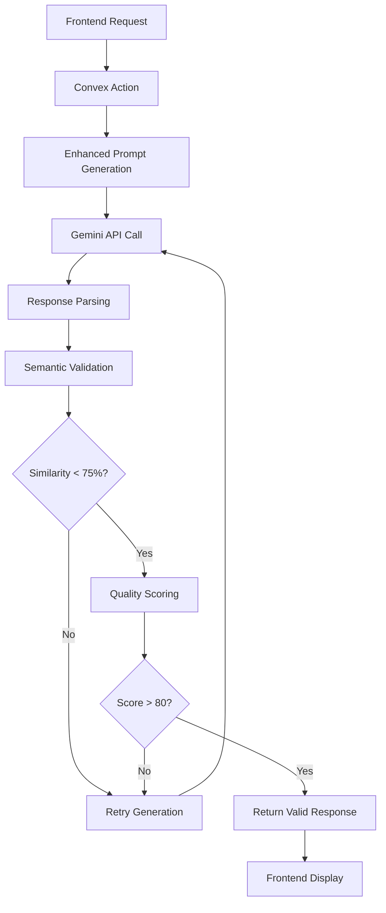
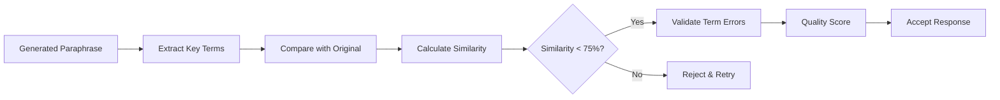

# Product Requirements Document (PRD)
## Sistema de Generación Consistente de Paráfrasis Incorrectas

## 🎯 OBJETIVO GENERAL
Implementar un sistema de generación de paráfrasis incorrectas 100% consistente que produzca ejercicios educativos con vocabulario técnico impreciso de manera predecible y controlada, eliminando la variabilidad actual que genera paráfrasis correctas o muy similares al original.

## 🏗️ ARQUITECTURA TARGET

### Flujo de Datos Optimizado
```
Frontend → Convex Action → Enhanced AI Prompt → Semantic Validation → Consistent Output
```

### Componentes Clave
1. **Enhanced Prompt System**: Prompts más específicos con ejemplos detallados
2. **Semantic Validation Layer**: Verificación automática de diferencias semánticas
3. **Template-Based Generation**: Patrones predefinidos de transformaciones incorrectas
4. **Quality Scoring System**: Métricas de calidad para paráfrasis incorrectas

## ✅ SUCCESS CRITERIA

### Métricas Técnicas de Éxito
- **100% Paráfrasis Incorrectas**: 0% de paráfrasis correctas o muy similares
- **Similitud Semántica < 75%**: Diferencia significativa del original
- **2-3 Términos Técnicos Imprecisos**: Por paráfrasis generada
- **Consistencia > 98%**: Entre generaciones múltiples
- **Tiempo de Respuesta < 3s**: Para generación de 3 paráfrasis

### Métricas Educativas
- **Errores Realistas**: Simulan errores comunes de estudiantes
- **Vocabulario Impreciso Consistente**: Mismo tipo de transformaciones
- **Contexto Mantenido**: Tema general preservado
- **Feedback Educativo**: Explicaciones claras de errores

## 🎯 SCOPE MVP

### INCLUIDO EN MVP:
#### Backend (Convex + Gemini)
- ✅ Enhanced prompt engineering con ejemplos específicos
- ✅ Configuración optimizada de IA (temperatura 0.3-0.5)
- ✅ Sistema de validación semántica post-generación
- ✅ Template system para transformaciones incorrectas
- ✅ Quality scoring y re-generación automática

#### Frontend (React/TypeScript)
- ✅ Fix del bug en `startParaphraseMode` (parámetro incorrecto)
- ✅ Improved error handling y loading states
- ✅ Enhanced UI feedback para paráfrasis incorrectas
- ✅ Debug mode para testing de consistencia

#### Testing & Validation
- ✅ Automated testing suite para validar consistencia
- ✅ Semantic similarity testing
- ✅ Performance benchmarking

### EXCLUIDO DEL MVP:
- ❌ Machine Learning model personalizado (usar Gemini optimizado)
- ❌ Advanced NLP libraries (mantener simplicidad)
- ❌ Multi-language support (focus en español)
- ❌ User customization de tipos de errores

## 🔧 ESPECIFICACIONES TÉCNICAS

### Backend Specifications:
- **Runtime**: Node.js 20+ (Convex environment)
- **AI Provider**: Google Gemini 1.5-flash
- **Temperature**: 0.3-0.5 (reducida para consistencia)
- **Validation**: Semantic similarity scoring
- **Retry Logic**: Hasta 3 intentos para paráfrasis válidas
- **Response Time**: < 3 segundos target

### Frontend Specifications:
- **Framework**: React 18+ con TypeScript
- **State Management**: React hooks (useState, useEffect)
- **Error Handling**: Try-catch con user feedback
- **Loading States**: Skeleton UI durante generación
- **Debug Mode**: Console logging para development

### API Design:
```typescript
// Enhanced generateAntiAffirmations function
interface AntiAffirmationRequest {
  originalAffirmations: Array<{
    content: string;
    order: number;
  }>;
  options?: {
    strictMode?: boolean;
    maxRetries?: number;
    targetSimilarity?: number;
  };
}

interface AntiAffirmationResponse {
  content: string;
  order: number;
  errorType: string;
  incorrectTerms: Array<{
    incorrect: string;
    correct: string;
    explanation: string;
  }>;
  qualityScore: number;
  semanticSimilarity: number;
}
```

### Performance Targets:
- **Generation Time**: < 3 segundos para 3 paráfrasis
- **Success Rate**: > 98% paráfrasis incorrectas válidas
- **Memory Usage**: < 50MB durante generación
- **Error Rate**: < 2% fallos de API

## 📊 DIAGRAMAS DE ARQUITECTURA

### Flujo de Generación Mejorado


### Sistema de Validación


## 🚀 IMPLEMENTACIÓN STRATEGY

### Phase 1: Core Fixes (Sprint 1)
1. Fix frontend bug en `startParaphraseMode`
2. Optimize AI configuration (temperature, prompts)
3. Implement basic semantic validation

### Phase 2: Enhanced Validation (Sprint 2)
1. Template-based error generation
2. Quality scoring system
3. Automated retry logic

### Phase 3: Testing & Optimization (Sprint 3)
1. Comprehensive testing suite
2. Performance optimization
3. User experience improvements
