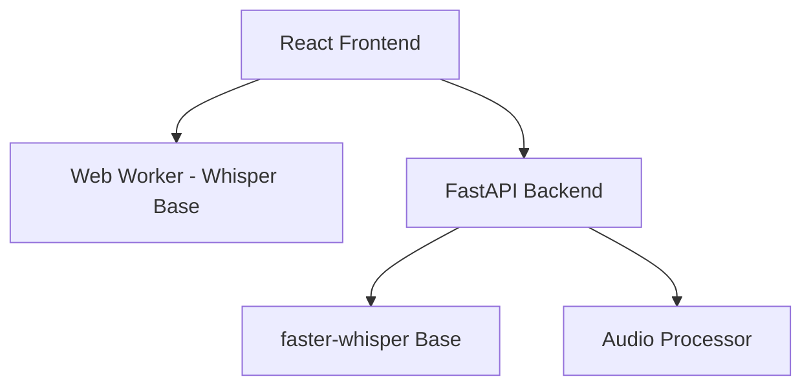
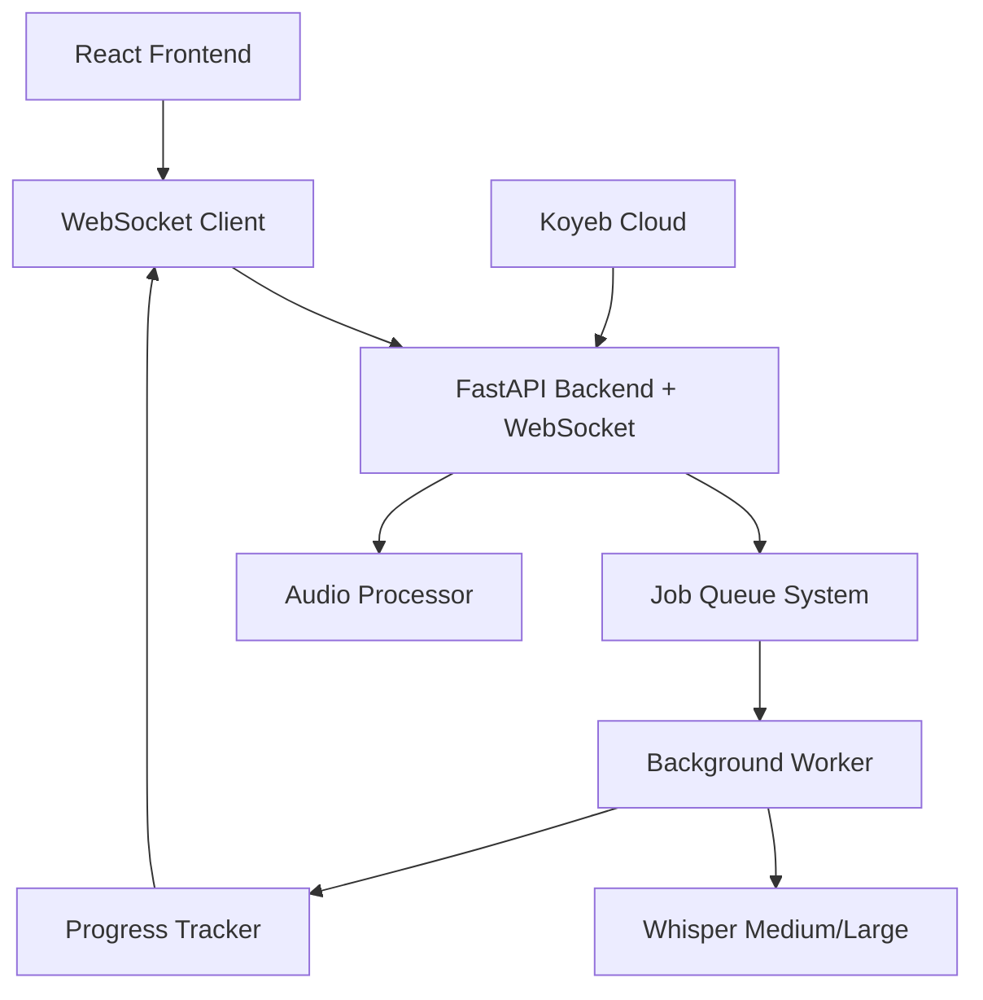
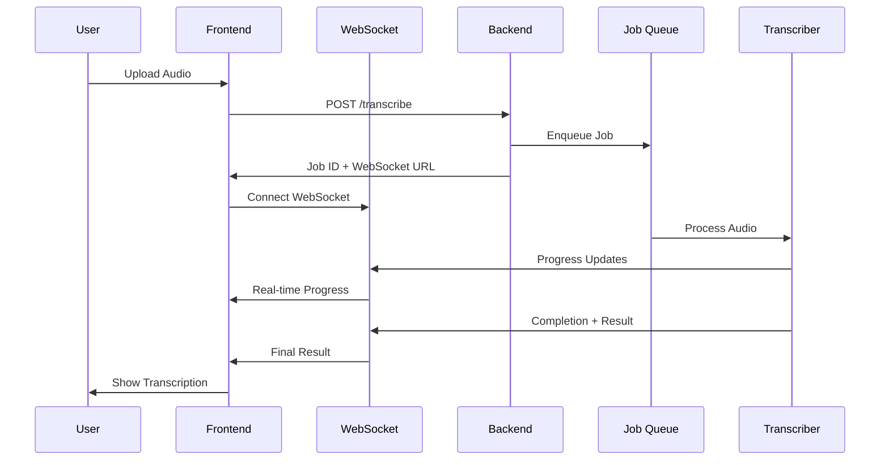
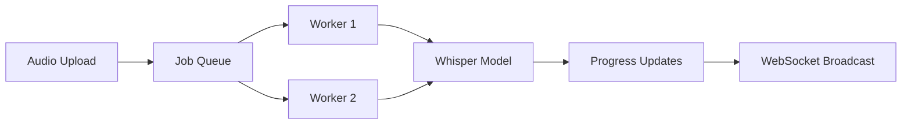

# Product Requirements Document (PRD)
# Retender - AI Audio Transcription System Upgrade

## 🎯 OBJETIVO GENERAL
Upgradar el sistema de transcripción de audio de Retender de Whisper-base a Whisper-medium/large con procesamiento en background, barra de progreso en tiempo real, y deployment en Koyeb free tier, manteniendo alta performance y UX fluida.

## 🏗️ ARQUITECTURA TARGET

### Current Architecture

### Target Architecture

## ✅ SUCCESS CRITERIA

### Performance Targets
- **Transcription Accuracy**: >95% (upgrade from base model)
- **Processing Time**: <2x real-time for audio files
- **Memory Usage**: <1GB peak (Koyeb compatibility)
- **API Response Time**: <200ms for job submission
- **WebSocket Latency**: <100ms for progress updates

### Functional Requirements
- ✅ Background transcription processing
- ✅ Real-time progress bar (0-100%)
- ✅ Support for audio files up to 25MB
- ✅ Automatic language detection
- ✅ WebSocket connection resilience
- ✅ Job queue with priority handling
- ✅ Error handling and retry logic

## 🎯 SCOPE MVP

### INCLUIDO EN MVP:
- **Backend Upgrade**: FastAPI + WebSocket + Job Queue
- **Model Upgrade**: Whisper base → medium (compromise for Koyeb)
- **Progress System**: Real-time WebSocket progress updates
- **Background Processing**: Async job queue with worker threads
- **Frontend Updates**: Progress UI components + WebSocket integration
- **Koyeb Deployment**: Docker optimization for cloud deployment
- **Error Handling**: Comprehensive error states and retry logic

### EXCLUIDO DEL MVP:
- **Whisper-large**: Demasiado pesado para Koyeb free tier
- **Multiple concurrent users**: Limitado por recursos gratuitos
- **Advanced audio preprocessing**: Mantener procesamiento actual
- **Real-time streaming**: Solo batch processing
- **User authentication**: Usar sistema actual
- **Advanced analytics**: Métricas básicas solamente

## 🔧 ESPECIFICACIONES TÉCNICAS

### Frontend Specifications:
- **Framework**: React 19 + Vite 6.2.0 (mantener actual)
- **TypeScript**: 5.7.2 con tipos estrictos
- **WebSocket Client**: Native WebSocket API con reconnection logic
- **State Management**: React hooks + Context para transcription state
- **UI Components**: Progress bar, status indicators, error states
- **Bundle Target**: <500KB adicional para nuevas features

### Backend Specifications:
- **Runtime**: Python 3.10+ (mantener actual)
- **Framework**: FastAPI 0.100.0+ con WebSocket support
- **Job Queue**: asyncio-based queue + background tasks
- **Model**: faster-whisper medium (compromise performance/size)
- **WebSocket**: FastAPI WebSocket endpoints
- **Database**: Convex (mantener actual) + job status tracking
- **Memory Management**: Model loading/unloading dinámico

### DevOps & Deployment:
- **Container**: Docker optimizado para Koyeb
- **Build Tool**: Docker multi-stage build
- **Package Manager**: pip con requirements.txt optimizado
- **Deployment**: Koyeb free tier
- **Environment**: Variables de entorno para model selection
- **Monitoring**: Logs estructurados + health checks

## 📊 DIAGRAMAS DE ARQUITECTURA

### WebSocket Flow

### Job Queue System

## 🚀 TECHNICAL IMPLEMENTATION STRATEGY

### Phase 1: Backend Infrastructure
1. WebSocket endpoints en FastAPI
2. Job queue system con asyncio
3. Background worker implementation
4. Progress tracking system

### Phase 2: Model Integration
1. Whisper medium integration
2. Dynamic model loading
3. Memory optimization
4. Error handling

### Phase 3: Frontend Integration
1. WebSocket client implementation
2. Progress UI components
3. State management updates
4. Error state handling

### Phase 4: Deployment Optimization
1. Docker optimization para Koyeb
2. Environment configuration
3. Health checks y monitoring
4. Performance tuning

## 🔒 CONSTRAINTS & ASSUMPTIONS

### Technical Constraints:
- **Koyeb Free Tier**: Limited RAM/CPU/Storage
- **Model Size**: Medium model max (~1.5GB)
- **Concurrent Users**: Limited by free tier resources
- **Processing Time**: Longer than local processing

### Assumptions:
- Users accept longer processing time for better accuracy
- WebSocket connections are stable enough for progress updates
- Koyeb free tier provides sufficient resources for medium model
- Current audio preprocessing is adequate
