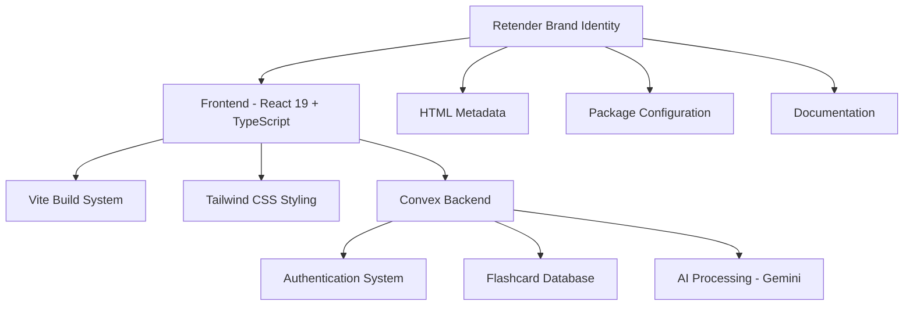
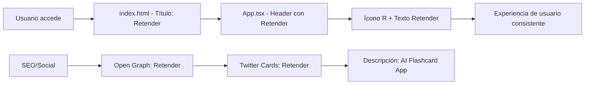
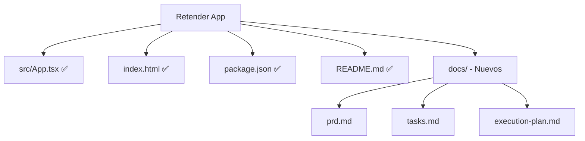

# Product Requirements Document (PRD) - Retender

## 🎯 OBJETIVO GENERAL
Transformar completamente la aplicación de "Kioku" a "Retender", cambiando de un sistema de flashcards con spaced repetition a un sistema innovador de afirmaciones generadas por IA, donde cada set contiene exactamente 3 afirmaciones poderosas sobre el contenido analizado.

## 🏗️ ARQUITECTURA TARGET
La aplicación mantiene su arquitectura técnica actual pero con branding completamente actualizado:

## ✅ SUCCESS CRITERIA
### Funcionales:
- ✅ Sistema completo de afirmaciones objetivas (3 por set)
- ✅ Detección automática de tipo de contenido (General vs Programming)
- ✅ Prompts especializados con límites de palabras precisos
- ✅ Sistema innovador de anti-afirmaciones para práctica
- ✅ Modo de práctica interactivo con scoring
- ✅ Feedback inmediato y explicaciones de errores
- ✅ Interface gamificada y engaging

### Técnicos:
- ✅ IA especializada con Gemini API funcionando al 100%
- ✅ Base de datos transformada (affirmationSets + affirmations)
- ✅ APIs RESTful completas con TypeScript
- ✅ Sistema de autenticación seguro
- ✅ Testing completo con casos reales validados
- ✅ Arquitectura escalable y mantenible

## 🎯 SCOPE MVP
### INCLUIDO EN MVP:
- ✅ Sistema completo de afirmaciones (3 por set)
- ✅ IA que genera afirmaciones declarativas
- ✅ Interface de revisión simple y elegante
- ✅ Base de datos transformada (affirmationSets + affirmations)
- ✅ Eliminación completa de flashcards y spaced repetition
- ✅ Eliminación de funcionalidad de screen recording
- ✅ Rebranding completo a "Retender"
- ✅ UI adaptada al nuevo concepto

### EXCLUIDO DEL MVP:
- Logo profesional personalizado
- Favicon personalizado
- Funcionalidades de colaboración
- Exportación de afirmaciones
- Categorización avanzada

## 🔧 ESPECIFICACIONES TÉCNICAS
### Frontend Specifications:
- **Framework**: Next.js-style React 19 con Vite
- **TypeScript**: Configuración estricta mantenida
- **Styling**: Tailwind CSS con tema existente
- **State Management**: Convex React hooks
- **Performance Targets**: 
  - First Contentful Paint < 1.5s
  - Largest Contentful Paint < 2.5s
  - Bundle size mantenido

### Backend Specifications:
- **Runtime**: Node.js con Convex
- **Database**: Convex database (sin cambios)
- **Authentication**: Convex Auth mantenido
- **AI Integration**: Gemini API (sin cambios)

### DevOps & Deployment:
- **Build Tool**: Vite 6.3.0
- **Package Manager**: npm
- **Development**: Hot reload mantenido
- **Production**: Build optimizado

## 📊 DIAGRAMAS DE ARQUITECTURA

### Flujo de Branding Actualizado:

### Estructura de Archivos Modificados:

