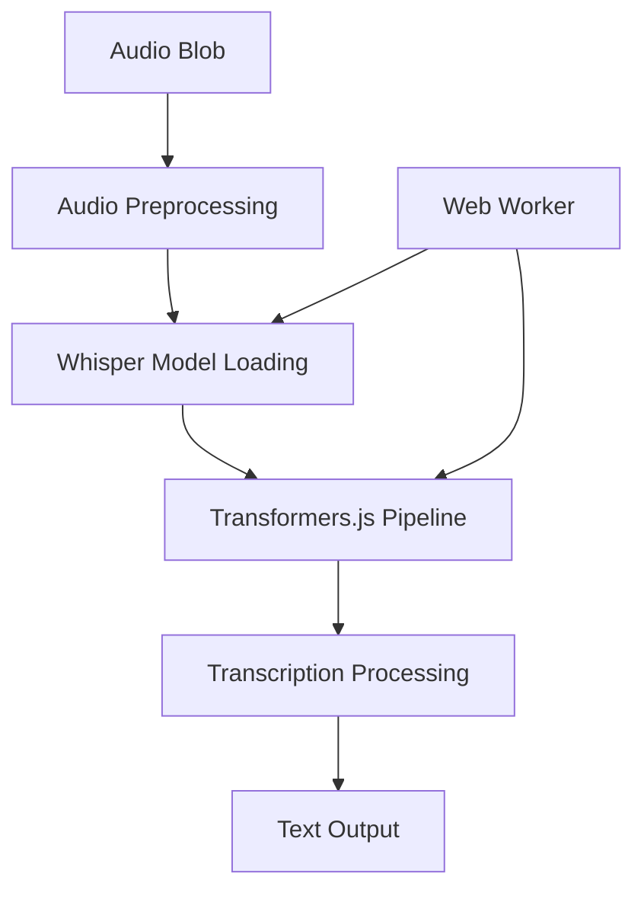

# Task Breakdown Structure - Sistema de Grabación y Transcripción

## 🔴 TAREAS P0 (CRÍTICAS - BLOQUEAN MVP)

### 📋 TAREA P0.1 - ScreenRecorder Component
**🎯 OBJETIVO**: Implementar grabación de pantalla con audio usando MediaRecorder API
**🔗 DEPENDENCIAS**: MediaRecorder API, getDisplayMedia(), Web Audio API
**⏱️ ESTIMACIÓN**: Complejidad Alta

#### SUBTAREAS:
##### P0.1.1 - Crear ScreenRecorder.tsx
- 🔍 **Análisis Técnico**: Componente React con MediaRecorder API para capturar pantalla + audio del sistema
- 📊 **Diagrama**:
```mermaid
graph TD
A[ScreenRecorder] --> B[Recording Controls]
B --> C[Start Recording Button]
B --> D[Stop Recording Button]
B --> E[Recording Status]
A --> F[MediaRecorder Setup]
F --> G[getDisplayMedia()]
F --> H[Audio Constraints]
A --> I[Recording Output]
I --> J[Video Blob]
I --> K[Audio Extraction]
```
- 🛠️ **Implementación MVP**:
  - Hook useScreenRecorder para lógica de grabación
  - getDisplayMedia() con audio: true para capturar audio del sistema
  - MediaRecorder con formato webm/mp4
  - Estados: idle, recording, processing, completed
  - Controles de inicio/parada con indicadores visuales
  - Timer de grabación en tiempo real
  - Límite máximo de 20 minutos
- 🧪 **Pruebas de Integración**: Verificar grabación de pantalla + audio en Chrome/Firefox
- 🔗 **Integraciones**: Permisos de navegador, manejo de errores de API
- ⚡ **Performance**: Optimización de memoria para grabaciones largas

##### P0.1.2 - Audio Extraction Service
- 🔍 **Análisis Técnico**: Extraer audio de grabación de video usando Web Audio API
- 🛠️ **Implementación MVP**:
  - Función extractAudioFromVideo(videoBlob): Promise<audioBlob>
  - Conversión a formato WAV/MP3 para compatibilidad
  - Compresión de audio para archivos largos
  - Progress callback para UI feedback
- 🧪 **Pruebas de Integración**: Verificar extracción con grabaciones de 10-20 min
- 🔗 **Integraciones**: Web Audio API, File API
- ⚡ **Performance**: Web Workers para procesamiento pesado

### 📋 TAREA P0.2 - Transcription Engine (100% Local)
**🎯 OBJETIVO**: Implementar transcripción de audio con Whisper completamente local
**🔗 DEPENDENCIAS**: Transformers.js, Whisper.cpp + WASM, Web Workers
**⏱️ ESTIMACIÓN**: Complejidad Alta

#### SUBTAREAS:
##### P0.2.1 - Transformers.js Whisper Integration (Modo Estándar)
- 🔍 **Análisis Técnico**: Integrar @xenova/transformers con modelo Whisper para transcripción 100% local
- 📊 **Diagrama**:

- 🛠️ **Implementación MVP**:
  - Instalar @xenova/transformers
  - Cargar modelo openai/whisper-base en Web Worker
  - Pipeline de automatic-speech-recognition
  - Chunking para audios largos (>5 min)
  - Progress tracking para UI
  - Cache de modelo para reutilización
- 🧪 **Pruebas de Integración**: Transcribir audio de 10-20 min con precisión >90%
- 🔗 **Integraciones**: Web Workers, IndexedDB para cache
- ⚡ **Performance**: Modelo quantizado, procesamiento en chunks

##### P0.2.2 - Whisper.cpp + WASM Integration (Modo Ultra-Rápido)
- 🔍 **Análisis Técnico**: Integrar Whisper.cpp compilado a WebAssembly para máximo rendimiento
- 🛠️ **Implementación MVP**:
  - Descargar whisper.cpp precompilado a WASM
  - Cargar modelo Whisper en formato GGML
  - Interface JavaScript para WASM module
  - Procesamiento 3-5x más rápido que Transformers.js
  - Menor uso de memoria para archivos largos
- 🧪 **Pruebas de Integración**: Comparar velocidad vs Transformers.js
- 🔗 **Integraciones**: Web Workers, SharedArrayBuffer
- ⚡ **Performance**: Máximo rendimiento local

##### P0.2.3 - Transcription Manager Component
- 🔍 **Análisis Técnico**: UI para seleccionar modo de transcripción local y mostrar progreso
- 🛠️ **Implementación MVP**:
  - Toggle Transformers.js/Whisper.cpp mode
  - Progress bar con tiempo estimado
  - Transcription viewer con timestamps
  - Export functionality (TXT, JSON, SRT)
  - Error handling y retry options
  - Model download progress indicator
- 🧪 **Pruebas de Integración**: Flujo completo de transcripción local
- 🔗 **Integraciones**: ScreenRecorder output, Translation Engine
- ⚡ **Performance**: Streaming de resultados, lazy loading

### 📋 TAREA P0.3 - Translation Engine (100% Local)
**🎯 OBJETIVO**: Implementar traducción local de transcripciones a 200+ idiomas
**🔗 DEPENDENCIAS**: Transformers.js, NLLB model, mT5 model
**⏱️ ESTIMACIÓN**: Complejidad Media

#### SUBTAREAS:
##### P0.3.1 - NLLB Translation Service (Local)
- 🔍 **Análisis Técnico**: Usar NLLB (No Language Left Behind) de Meta para traducción local
- 🛠️ **Implementación MVP**:
  - Cargar modelo `facebook/nllb-200-distilled-600M`
  - Pipeline de translation con Transformers.js
  - Soporte para 200+ idiomas
  - Chunking para textos largos
  - Preservación de timestamps
  - Cache de traducciones en IndexedDB
- 🧪 **Pruebas de Integración**: Traducir transcripciones de 10-20 min
- 🔗 **Integraciones**: Transcription output, Web Workers
- ⚡ **Performance**: Procesamiento en chunks, cache inteligente

##### P0.3.2 - Translation Viewer Component
- 🔍 **Análisis Técnico**: UI para mostrar transcripción original y traducción lado a lado
- 🛠️ **Implementación MVP**:
  - Layout de dos columnas (original | traducción)
  - Selector de idioma target (200+ idiomas)
  - Sincronización de scroll
  - Highlight de segmentos correspondientes
  - Export de ambas versiones (TXT, JSON, SRT)
  - Progress indicator para traducción
- 🧪 **Pruebas de Integración**: Verificar UX con textos largos
- 🔗 **Integraciones**: NLLB translation service, Export manager
- ⚡ **Performance**: Virtualización para textos largos, lazy translation

### 📋 TAREA P0.4 - Integration & File Management
**🎯 OBJETIVO**: Integrar todos los componentes y gestionar archivos
**🔗 DEPENDENCIAS**: Convex File Storage, Dashboard existente
**⏱️ ESTIMACIÓN**: Complejidad Media

#### SUBTAREAS:
##### P0.4.1 - Recording Manager Component
- 🔍 **Análisis Técnico**: Componente principal que orquesta todo el flujo
- 🛠️ **Implementación MVP**:
  - Stepper UI: Record → Extract → Transcribe → Translate
  - Estado global con Zustand
  - File management temporal
  - Progress tracking global
  - Error recovery en cada paso
- 🧪 **Pruebas de Integración**: Flujo completo end-to-end
- 🔗 **Integraciones**: Todos los componentes anteriores
- ⚡ **Performance**: Lazy loading de componentes

##### P0.4.2 - Dashboard Integration
- 🔍 **Análisis Técnico**: Agregar nueva sección "Recording" al Dashboard
- 🛠️ **Implementación MVP**:
  - Nuevo botón "Record & Transcribe" en Quick Actions
  - Vista recording-manager en Dashboard
  - Navegación entre grabación y sesiones existentes
  - Breadcrumbs para orientación
- 🧪 **Pruebas de Integración**: Navegación fluida entre funcionalidades
- 🔗 **Integraciones**: Dashboard existente, estado de navegación
- ⚡ **Performance**: Code splitting para componentes de grabación

## 🟡 TAREAS P1 (ALTAS - MEJORAS IMPORTANTES)

### 📋 TAREA P1.1 - Advanced Audio Processing
**🎯 OBJETIVO**: Mejorar calidad de audio y transcripción
**🔗 DEPENDENCIAS**: Web Audio API, Audio Worklets
**⏱️ ESTIMACIÓN**: Complejidad Alta

#### SUBTAREAS:
##### P1.1.1 - Noise Reduction
- 🔍 **Análisis Técnico**: Implementar filtros de ruido para mejorar transcripción
- 🛠️ **Implementación**: Audio Worklets para procesamiento en tiempo real
- 🧪 **Pruebas de Integración**: Comparar precisión con/sin filtros

##### P1.1.2 - Voice Activity Detection (VAD)
- 🔍 **Análisis Técnico**: Detectar segmentos de voz para optimizar transcripción
- 🛠️ **Implementación**: Silero VAD model con Transformers.js
- 🧪 **Pruebas de Integración**: Verificar detección en audios con silencios

### 📋 TAREA P1.2 - Enhanced Translation Features
**🎯 OBJETIVO**: Mejorar capacidades de traducción
**🔗 DEPENDENCIAS**: Multiple translation APIs
**⏱️ ESTIMACIÓN**: Complejidad Media

#### SUBTAREAS:
##### P1.2.1 - Multi-Provider Translation
- 🔍 **Análisis Técnico**: Integrar DeepL y Google Translate como alternativas
- 🛠️ **Implementación**: Translation provider selector, fallback logic
- 🧪 **Pruebas de Integración**: Comparar calidad entre proveedores

##### P1.2.2 - Language Auto-Detection
- 🔍 **Análisis Técnico**: Detectar idioma automáticamente de transcripción
- 🛠️ **Implementación**: Language detection API o modelo local
- 🧪 **Pruebas de Integración**: Verificar detección con múltiples idiomas

## 🟢 TAREAS P2 (MEDIAS - OPTIMIZACIONES)

### 📋 TAREA P2.1 - Performance Optimizations
**🎯 OBJETIVO**: Optimizar rendimiento para archivos largos
**🔗 DEPENDENCIAS**: Web Workers, Streaming APIs
**⏱️ ESTIMACIÓN**: Complejidad Media

### 📋 TAREA P2.2 - Advanced Export Features
**🎯 OBJETIVO**: Múltiples formatos de exportación
**🔗 DEPENDENCIAS**: File APIs, Format libraries
**⏱️ ESTIMACIÓN**: Complejidad Baja

## 🔵 TAREAS P3 (BAJAS - NICE-TO-HAVE)

### 📋 TAREA P3.1 - Real-time Transcription
**🎯 OBJETIVO**: Transcripción en tiempo real durante grabación
**🔗 DEPENDENCIAS**: Streaming APIs, WebRTC
**⏱️ ESTIMACIÓN**: Complejidad Muy Alta

### 📋 TAREA P3.2 - Speaker Diarization
**🎯 OBJETIVO**: Identificar múltiples hablantes
**🔗 DEPENDENCIAS**: Advanced AI models
**⏱️ ESTIMACIÓN**: Complejidad Muy Alta
