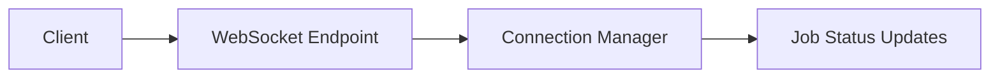
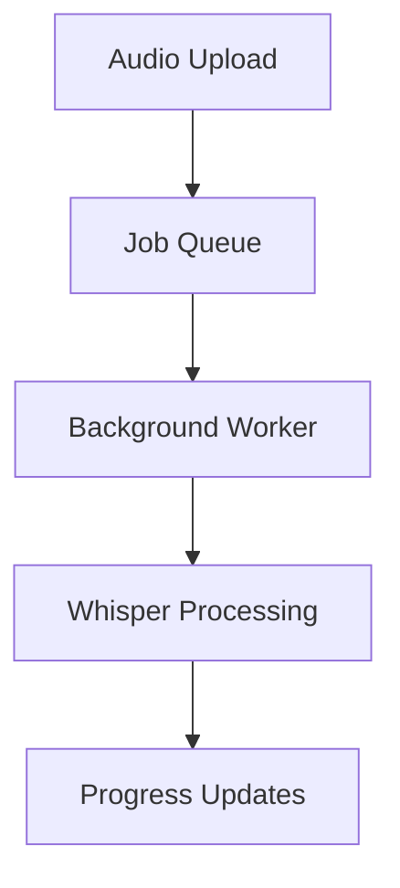

# Task Breakdown Structure
# Retender - Audio Transcription System Upgrade

## 🔴 TAREAS P0 (CRÍTICAS - BLOQUEAN MVP)

### 📋 TAREA P0.1 - Backend WebSocket Infrastructure
**🎯 OBJETIVO**: Implementar sistema de WebSocket + Job Queue para procesamiento en background
**🔗 DEPENDENCIAS**: FastAPI, asyncio, WebSocket support
**⏱️ ESTIMACIÓN**: Alta complejidad

#### SUBTAREAS:
##### P0.1.1 - WebSocket Endpoints Implementation
- 🔍 **Análisis Técnico**: FastAPI actual no tiene WebSocket endpoints, necesita upgrade
- 📊 **Diagrama**: 

- 🛠️ **Implementación MVP**: 
  - Crear `/ws/transcription/{job_id}` endpoint
  - Connection manager para múltiples clientes
  - Broadcast system para progress updates
- 🧪 **Pruebas de Integración**: WebSocket connection + message broadcasting
- 🔗 **Integraciones**: FastAPI WebSocket, asyncio tasks
- ⚡ **Performance**: <100ms latency para updates

##### P0.1.2 - Job Queue System
- 🔍 **Análisis Técnico**: Implementar asyncio-based queue para background processing
- 📊 **Diagrama**:

- 🛠️ **Implementación MVP**:
  - AsyncIO Queue con priority support
  - Background worker threads
  - Job status tracking (pending, processing, completed, failed)
- 🧪 **Pruebas de Integración**: Job enqueue → processing → completion flow
- 🔗 **Integraciones**: WebSocket updates, database logging
- ⚡ **Performance**: Handle 5+ concurrent jobs

##### P0.1.3 - Progress Tracking System
- 🔍 **Análisis Técnico**: Sistema para trackear progreso de transcripción en tiempo real
- 🛠️ **Implementación MVP**:
  - Progress callback integration con faster-whisper
  - WebSocket broadcast de progress updates
  - Error state handling y recovery
- 🧪 **Pruebas de Integración**: Progress 0% → 100% con updates cada 5%
- 🔗 **Integraciones**: WebSocket, Job Queue, Whisper callbacks

### 📋 TAREA P0.2 - Whisper Model Upgrade
**🎯 OBJETIVO**: Upgrade de whisper-base a whisper-medium con optimización de memoria
**🔗 DEPENDENCIAS**: faster-whisper, model management
**⏱️ ESTIMACIÓN**: Media complejidad

#### SUBTAREAS:
##### P0.2.1 - Model Configuration Update
- 🔍 **Análisis Técnico**: Cambiar configuración de "base" a "medium" en transcription_service.py
- 🛠️ **Implementación MVP**:
  - Update DEFAULT_MODEL en .env y configuración
  - Modificar load_model() para whisper-medium
  - Memory optimization para Koyeb constraints
- 🧪 **Pruebas de Integración**: Cargar modelo medium + transcripción exitosa
- ⚡ **Performance**: <2GB RAM usage, <30s model loading

##### P0.2.2 - Dynamic Model Loading
- 🔍 **Análisis Técnico**: Implementar carga/descarga dinámica para optimizar memoria
- 🛠️ **Implementación MVP**:
  - Model cache con TTL
  - Lazy loading cuando se necesita
  - Memory cleanup después de transcripción
- 🧪 **Pruebas de Integración**: Multiple transcriptions sin memory leaks
- ⚡ **Performance**: <1GB peak memory usage

### 📋 TAREA P0.3 - Frontend WebSocket Integration
**🎯 OBJETIVO**: Integrar WebSocket client con UI de progreso en tiempo real
**🔗 DEPENDENCIAS**: React hooks, WebSocket API, UI components
**⏱️ ESTIMACIÓN**: Media complejidad

#### SUBTAREAS:
##### P0.3.1 - WebSocket Hook Implementation
- 🔍 **Análisis Técnico**: Crear custom hook para WebSocket connection con reconnection
- 🛠️ **Implementación MVP**:
  - useWebSocket hook con auto-reconnect
  - Connection state management
  - Message handling para progress updates
- 🧪 **Pruebas de Integración**: Connection → progress updates → completion
- 🔗 **Integraciones**: useTranscription hook, progress UI components

##### P0.3.2 - Progress UI Components
- 🔍 **Análisis Técnico**: Crear componentes para mostrar progreso en tiempo real
- 🛠️ **Implementación MVP**:
  - ProgressBar component con percentage
  - Status indicators (queued, processing, completed, error)
  - Real-time updates sin re-renders excesivos
- 🧪 **Pruebas de Integración**: UI updates reflejan backend progress
- ⚡ **Performance**: <16ms render time, smooth animations

##### P0.3.3 - Transcription Service Update
- 🔍 **Análisis Técnico**: Modificar transcriptionService.ts para usar WebSocket
- 🛠️ **Implementación MVP**:
  - Update API calls para job-based processing
  - WebSocket integration para progress
  - Error handling y retry logic
- 🧪 **Pruebas de Integración**: Full flow desde upload hasta resultado final

## 🟡 TAREAS P1 (ALTAS - IMPORTANTES PARA FUNCIONALIDAD COMPLETA)

### 📋 TAREA P1.1 - Koyeb Deployment Optimization
**🎯 OBJETIVO**: Optimizar Docker y configuración para Koyeb free tier
**🔗 DEPENDENCIAS**: Docker, Koyeb platform, environment variables
**⏱️ ESTIMACIÓN**: Media complejidad

#### SUBTAREAS:
##### P1.1.1 - Docker Multi-stage Build
- 🔍 **Análisis Técnico**: Optimizar Dockerfile para menor tamaño y mejor performance
- 🛠️ **Implementación MVP**:
  - Multi-stage build para reducir image size
  - Python dependencies optimization
  - Model pre-download en build time
- 🧪 **Pruebas de Integración**: Docker build + run en ambiente similar a Koyeb
- ⚡ **Performance**: <2GB image size, <60s build time

##### P1.1.2 - Environment Configuration
- 🔍 **Análisis Técnico**: Configurar variables de entorno para Koyeb deployment
- 🛠️ **Implementación MVP**:
  - Koyeb-specific environment variables
  - Model selection basada en available resources
  - Health checks y monitoring endpoints
- 🧪 **Pruebas de Integración**: Deploy en Koyeb + health check passing

### 📋 TAREA P1.2 - Error Handling & Resilience
**🎯 OBJETIVO**: Implementar manejo robusto de errores y recovery mechanisms
**🔗 DEPENDENCIAS**: WebSocket reconnection, job retry logic
**⏱️ ESTIMACIÓN**: Baja complejidad

#### SUBTAREAS:
##### P1.2.1 - WebSocket Reconnection Logic
- 🔍 **Análisis Técnico**: Auto-reconnect cuando WebSocket connection se pierde
- 🛠️ **Implementación MVP**:
  - Exponential backoff para reconnection
  - State recovery después de reconnect
  - User notification de connection issues
- 🧪 **Pruebas de Integración**: Simular network issues + recovery

##### P1.2.2 - Job Retry Mechanism
- 🔍 **Análisis Técnico**: Retry failed transcription jobs automáticamente
- 🛠️ **Implementación MVP**:
  - Retry queue para failed jobs
  - Exponential backoff para retries
  - Max retry limits y dead letter queue
- 🧪 **Pruebas de Integración**: Simular job failures + successful retry

## 🟢 TAREAS P2 (MEDIAS - MEJORAS DE EXPERIENCIA)

### 📋 TAREA P2.1 - Advanced Progress Indicators
**🎯 OBJETIVO**: Mejorar UX con indicadores de progreso más detallados
**⏱️ ESTIMACIÓN**: Baja complejidad

#### SUBTAREAS:
##### P2.1.1 - Detailed Progress Stages
- 🛠️ **Implementación MVP**:
  - Stage indicators (uploading, queued, processing, finalizing)
  - Time estimates basados en file size
  - Progress percentage con smooth animations
- 🧪 **Pruebas de Integración**: UI muestra stages correctamente

### 📋 TAREA P2.2 - Performance Monitoring
**🎯 OBJETIVO**: Implementar métricas básicas de performance
**⏱️ ESTIMACIÓN**: Baja complejidad

#### SUBTAREAS:
##### P2.2.1 - Basic Metrics Collection
- 🛠️ **Implementación MVP**:
  - Processing time tracking
  - Memory usage monitoring
  - Success/failure rates
- 🧪 **Pruebas de Integración**: Metrics collection durante transcription

## 🔵 TAREAS P3 (BAJAS - OPTIMIZACIONES)

### 📋 TAREA P3.1 - Model Caching Optimization
**🎯 OBJETIVO**: Optimizar caching de modelo para mejor performance
**⏱️ ESTIMACIÓN**: Baja complejidad

### 📋 TAREA P3.2 - Advanced Audio Preprocessing
**🎯 OBJETIVO**: Mejorar preprocessing de audio para mejor accuracy
**⏱️ ESTIMACIÓN**: Baja complejidad
