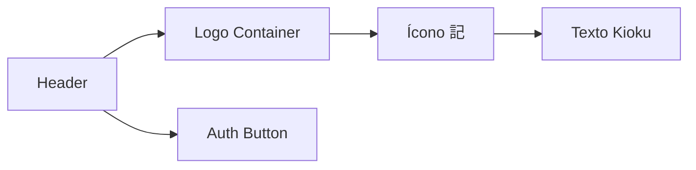
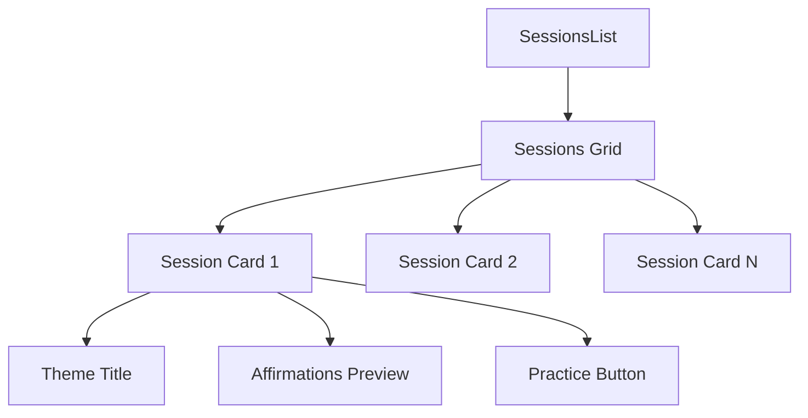

# Task Breakdown Structure - Sistema de Sesiones Inteligentes y Transcripción de Audio

## 🔴 TAREAS P0 (CRÍTICAS - TRANSCRIPCIÓN DE AUDIO)

### 📋 TAREA P0.A1 - Backend FastAPI Whisper 
**🎯 OBJETIVO**: Confirmar y documentar que el endpoint `POST /transcribe` funciona localmente con Whisper `base`.
**🔗 DEPENDENCIAS**: Python 3.10, FastAPI, whisper, ffmpeg
**⏱️ ESTIMACIÓN**: Baja

#### SUBTAREAS:
- 🔍 **Verificar Servicio**: Ejecutar `uvicorn api.main:app --reload` y probar con archivo de muestra
- 📊 **Diagrama**: Flujo FastAPI → TranscriptionService → Whisper → respuesta JSON
- 🛠️ **Ajustes Mínimos**: Asegurar variable de entorno OPENAI_API_KEY opcional, limpieza de temp
- 🧪 **Pruebas de Integración**: cURL o script Python que suba audio y verifique texto

### 📋 TAREA P0.A2 - Componente TranscriberForm (Frontend)
**🎯 OBJETIVO**: UI para cargar/grabar audio, mostrar progreso y transcripción
**🔗 DEPENDENCIAS**: React 18, TypeScript, Tailwind, TranscriptionApiClient
**⏱️ ESTIMACIÓN**: Media

#### SUBTAREAS:
- 🔍 **Diseño de UI**: Input file + botón grabar + barra de progreso + textarea resultado
- 🛠️ **Implementación MVP**: Lógica de carga, manejo de tamaño, estados loading/error
- 🧪 **Pruebas de Integración**: Simular archivo pequeño, verificar respuesta y renderizado

### 📋 TAREA P0.A3 - Flujo E2E Audio→Texto
**🎯 OBJETIVO**: End-to-end test que grabe/cargue audio y valide texto
**🔗 DEPENDENCIAS**: Playwright/Vitest, backend y frontend corriendo
**⏱️ ESTIMACIÓN**: Media

#### SUBTAREAS:
- 🔍 **Script Playwright**: Navegar a TranscriberForm, cargar archivo, esperar respuesta, assert contenido
- 🛠️ **Implementación**: Configurar servidor mock o sample audio
- 🧪 **Resultado**: Test pasa en < 2 min

## 🔴 TAREAS P0 (CRÍTICAS - SISTEMA DE SESIONES INTELIGENTES) - 

### 📋 TAREA P0.1 - Componente CreateSessions 
**🎯 OBJETIVO**: Crear interfaz para generar múltiples sesiones de afirmaciones desde texto extenso
**🔗 DEPENDENCIAS**: React 19, TypeScript, Convex hooks, generateSessions API ( ya implementado)
**⏱️ ESTIMACIÓN**: Alta 

#### SUBTAREAS:
##### P0.1.1 - Crear CreateSessions.tsx 
- 🔍 **Análisis Técnico**: Componente React con textarea para input masivo, botón de generación, estado de loading 
- 📊 **Diagrama**: 

- 🛠️ **Implementación MVP**: 
  - Textarea para contenido extenso (500+ caracteres mínimo)
  - Botón "Generate Sessions" con loading state
  - Llamada a generateSessions API con useAction
  - Manejo de errores y validación con toast notifications
  - Navegación a SessionsList al completar
  - Contador de caracteres y palabras en tiempo real
  - Secciones de ayuda y ejemplos
- 🧪 **Pruebas de Integración**: Verificar con contenido de 2718 caracteres
- 🔗 **Integraciones**: useAction para generateSessions, navegación con props
- ⚡ **Performance**: Loading states, validación de input

##### P0.1.2 - Integrar con Dashboard 
- 🔍 **Análisis Técnico**: Agregar nueva vista "sessions" al Dashboard existente 
- 🛠️ **Implementación MVP**: 
  - Nuevo estado currentView: "sessions" y "sessions-list"
  - Botón "Generate Sessions" en Quick Actions (azul, destacado)
  - Navegación bidireccional completa
  - Grid de 3 columnas en lugar de 2
- 🧪 **Pruebas de Integración**: Verificar navegación completa entre vistas
- 🔗 **Integraciones**: Estado de Dashboard, props de navegación, sessionsData state

### 📋 TAREA P0.2 - Componente SessionsList
**🎯 OBJETIVO**: Mostrar múltiples sesiones generadas con navegación y preview
**🔗 DEPENDENCIAS**: React 19, TypeScript, sessions data structure
**⏱️ ESTIMACIÓN**: Alta

#### SUBTAREAS:
##### P0.2.1 - Crear SessionsList.tsx
- 🔍 **Análisis Técnico**: Grid de sesiones con tema, preview de afirmaciones, botones de acción
- 📊 **Diagrama**:

- 🛠️ **Implementación MVP**:
  - Grid responsive de session cards
  - Preview de 3 afirmaciones por sesión
  - Tema/título descriptivo por sesión
  - Botón "Practice Session" por card
  - Navegación a ReviewInterface con sesión específica
- 🧪 **Pruebas de Integración**: Verificar con múltiples sesiones (3-6 sesiones)
- 🔗 **Integraciones**: Props de sessions data, callback para selección
- ⚡ **Performance**: Virtualización si >10 sesiones

##### P0.2.2 - Adaptar ReviewInterface para Sesiones
- 🔍 **Análisis Técnico**: Modificar ReviewInterface para aceptar sessions data en lugar de setId
- 🛠️ **Implementación MVP**:
  - Props opcional: sessionData vs setId
  - Lógica condicional para data source
  - Mantener funcionalidad existente de anti-afirmaciones
- 🧪 **Pruebas de Integración**: Verificar modo práctica con sessions vs sets
- 🔗 **Integraciones**: Backward compatibility con sets existentes

### 📋 TAREA P0.3 - Integración Completa del Sistema
**🎯 OBJETIVO**: Conectar todos los componentes en flujo completo funcional
**🔗 DEPENDENCIAS**: CreateSessions, SessionsList, Dashboard, ReviewInterface
**⏱️ ESTIMACIÓN**: Media

#### SUBTAREAS:
##### P0.3.1 - Flujo de Navegación Completo
- 🔍 **Análisis Técnico**: Estado global de navegación entre vistas y data passing
- 🛠️ **Implementación MVP**:
  - Dashboard → CreateSessions → SessionsList → ReviewInterface
  - Estado compartido para sessions data
  - Navegación "Back" en cada nivel
  - Breadcrumbs o indicador de posición
- 🧪 **Pruebas de Integración**: Flujo completo end-to-end con contenido real
- 🔗 **Integraciones**: Props drilling o Context API para estado compartido

##### P0.3.2 - Manejo de Estados y Errores
- 🔍 **Análisis Técnico**: Loading states, error handling, empty states
- 🛠️ **Implementación MVP**:
  - Loading spinners en generación de sesiones
  - Error messages con retry functionality
  - Empty states cuando no hay sesiones
  - Validación de input mínimo (500+ caracteres)
- 🧪 **Pruebas de Integración**: Casos edge: texto muy corto, API errors, timeout
- 🔗 **Integraciones**: Toast notifications (Sonner), error boundaries

## 🔴 TAREAS P0 ANTERIORES (COMPLETADAS )

### 📋 TAREA P0.4 - Actualización de UI Principal (COMPLETADA )
**🎯 OBJETIVO**: Cambiar el nombre visible "Kioku" por "Retender" en la interfaz principal
**🔗 DEPENDENCIAS**: React, TypeScript, Tailwind CSS
**⏱️ ESTIMACIÓN**: Baja 

#### SUBTAREAS:
##### P0.1.1 - Modificar Header Component 
- 🔍 **Análisis Técnico**: Componente App.tsx línea 17, elemento h1 con "Kioku"
- 📊 **Diagrama**: 

- 🛠️ **Implementación MVP**: Cambio de "Kioku" a "Retender" y "記" a "R"
- 🧪 **Pruebas de Integración**: Verificar que header se renderiza correctamente
- 🔗 **Integraciones**: Mantiene integración con SignOutButton
- ⚡ **Performance**: Sin impacto en performance

##### P0.1.2 - Actualizar Ícono Temporal 
- 🔍 **Análisis Técnico**: Span con carácter japonés "記" en línea 15
- 🛠️ **Implementación MVP**: Cambio a letra "R" como placeholder
- 🧪 **Pruebas de Integración**: Verificar que ícono se muestra correctamente

### 📋 TAREA P0.5 - Metadatos HTML y SEO (COMPLETADA )
**🎯 OBJETIVO**: Actualizar título y metadatos para SEO y redes sociales
**🔗 DEPENDENCIAS**: HTML5, Open Graph, Twitter Cards
**⏱️ ESTIMACIÓN**: Baja 

#### SUBTAREAS:
##### P0.2.1 - Título del Navegador 
- 🔍 **Análisis Técnico**: index.html línea 8, elemento title con "Chef"
- 🛠️ **Implementación MVP**: Cambio a "Retender"
- 🧪 **Pruebas de Integración**: Verificar título en pestaña del navegador

##### P0.2.2 - Metadatos Open Graph 
- 🔍 **Análisis Técnico**: Agregar metadatos completos para redes sociales
- 🛠️ **Implementación MVP**: 
  - og:title: "Retender - AI Flashcard App"
  - og:description: Descripción de la aplicación
  - og:type: "website"
- 🧪 **Pruebas de Integración**: Verificar preview en redes sociales

##### P0.2.3 - Twitter Cards 
- 🔍 **Análisis Técnico**: Metadatos específicos para Twitter
- 🛠️ **Implementación MVP**: twitter:card, twitter:title, twitter:description
- 🧪 **Pruebas de Integración**: Verificar preview en Twitter

### 📋 TAREA P0.6 - Configuración del Proyecto (COMPLETADA )
**🎯 OBJETIVO**: Actualizar configuraciones y documentación del proyecto
**🔗 DEPENDENCIAS**: npm, package.json, markdown
**⏱️ ESTIMACIÓN**: Baja 

#### SUBTAREAS:
##### P0.3.1 - Package.json 
- 🔍 **Análisis Técnico**: package.json línea 2, name: "flex-template"
- 🛠️ **Implementación MVP**: Cambio a "retender"
- 🧪 **Pruebas de Integración**: Verificar que npm scripts funcionan
- 🔗 **Integraciones**: Mantiene todas las dependencias y scripts

##### P0.3.2 - README.md 
- 🔍 **Análisis Técnico**: README.md línea 1, título genérico
- 🛠️ **Implementación MVP**: "# Retender - AI Flashcard App"
- 🧪 **Pruebas de Integración**: Verificar que documentación es clara

### 📋 TAREA P0.7 - Eliminación de Funcionalidad de Grabación de Pantalla (COMPLETADA )
**🎯 OBJETIVO**: Remover completamente la funcionalidad de screen recording/grabación de pantalla
**🔗 DEPENDENCIAS**: React components, Convex backend, database schema
**⏱️ ESTIMACIÓN**: Media 

#### SUBTAREAS:
##### P0.4.1 - Eliminar Componentes Frontend 
- 🔍 **Análisis Técnico**: ScreenRecorder.tsx y RecordingsList.tsx
- 🛠️ **Implementación MVP**: Archivos eliminados completamente
- 🧪 **Pruebas de Integración**: Dashboard funciona sin errores
- 🔗 **Integraciones**: Imports removidos del Dashboard

##### P0.4.2 - Actualizar Dashboard 
- 🔍 **Análisis Técnico**: Remover botón "Record Screen" y vista de grabaciones
- 🛠️ **Implementación MVP**: Grid cambiado de 3 a 2 columnas, referencias eliminadas
- 🧪 **Pruebas de Integración**: UI limpia y funcional
- 🔗 **Integraciones**: Estado de vista actualizado

##### P0.4.3 - Eliminar Backend de Grabaciones 
- 🔍 **Análisis Técnico**: convex/recordings.ts y tabla en schema
- 🛠️ **Implementación MVP**: Archivo e índices de tabla eliminados
- 🧪 **Pruebas de Integración**: Convex detectó cambios automáticamente
- 🔗 **Integraciones**: Schema actualizado sin tabla recordings

## TAREAS P1 (ALTAS - MEJORAS FUTURAS)

### TAREA P1.1 - Logo Profesional
**🎯 OBJETIVO**: Crear logo profesional para Retender
**🔗 DEPENDENCIAS**: Diseño gráfico, SVG, React components
**⏱️ ESTIMACIÓN**: Media

#### SUBTAREAS:
##### P1.1.1 - Diseño de Logo
- 🔍 **Análisis Técnico**: Crear SVG escalable para diferentes tamaños
- 🛠️ **Implementación**: Componente React para logo
- 🧪 **Pruebas de Integración**: Verificar en diferentes resoluciones

##### P1.1.2 - Integración en Header
- 🔍 **Análisis Técnico**: Reemplazar div con span por componente Logo
- 🛠️ **Implementación**: Importar y usar LogoComponent
- 🧪 **Pruebas de Integración**: Verificar responsive design

### TAREA P1.2 - Favicon Personalizado
**🎯 OBJETIVO**: Crear favicon personalizado para Retender
**🔗 DEPENDENCIAS**: Diseño de iconos, formatos web
**⏱️ ESTIMACIÓN**: Baja

#### SUBTAREAS:
##### P1.2.1 - Crear Favicon
- 🔍 **Análisis Técnico**: Generar .ico, .png en múltiples tamaños
- 🛠️ **Implementación**: Archivos en public/ y links en HTML
- 🧪 **Pruebas de Integración**: Verificar en diferentes navegadores

## TAREAS P2 (MEDIAS - OPTIMIZACIONES)

### TAREA P2.1 - Colores de Marca
**🎯 OBJETIVO**: Definir paleta de colores específica para Retender
**🔗 DEPENDENCIAS**: Tailwind CSS, design system
**⏱️ ESTIMACIÓN**: Media

### TAREA P2.2 - Animaciones de Marca
**🎯 OBJETIVO**: Agregar micro-animaciones para mejorar UX
**🔗 DEPENDENCIAS**: CSS animations, React transitions
**⏱️ ESTIMACIÓN**: Media

## TAREAS P3 (BAJAS - NICE-TO-HAVE)

### TAREA P3.1 - Tema Oscuro
**🎯 OBJETIVO**: Implementar modo oscuro para Retender
**🔗 DEPENDENCIAS**: Tailwind dark mode, React context
**⏱️ ESTIMACIÓN**: Alta

### TAREA P3.2 - PWA Manifest
**🎯 OBJETIVO**: Configurar aplicación como PWA
**🔗 DEPENDENCIAS**: Web App Manifest, Service Worker
**⏱️ ESTIMACIÓN**: Media
