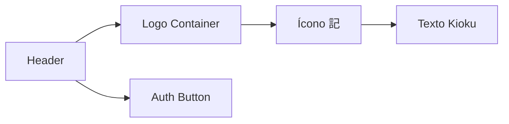

# Task Breakdown Structure - Retender Rebranding

## 🔴 TAREAS P0 (CRÍTICAS - COMPLETADAS ✅)

### 📋 TAREA P0.1 - Actualización de UI Principal
**🎯 OBJETIVO**: Cambiar el nombre visible "Kioku" por "Retender" en la interfaz principal
**🔗 DEPENDENCIAS**: React, TypeScript, Tailwind CSS
**⏱️ ESTIMACIÓN**: Baja ✅ COMPLETADA

#### SUBTAREAS:
##### P0.1.1 - Modificar Header Component ✅
- 🔍 **Análisis Técnico**: Componente App.tsx línea 17, elemento h1 con "Kioku"
- 📊 **Diagrama**: 

- 🛠️ **Implementación MVP**: Cambio de "Kioku" a "Retender" y "記" a "R"
- 🧪 **Pruebas de Integración**: Verificar que header se renderiza correctamente
- 🔗 **Integraciones**: Mantiene integración con SignOutButton
- ⚡ **Performance**: Sin impacto en performance

##### P0.1.2 - Actualizar Ícono Temporal ✅
- 🔍 **Análisis Técnico**: Span con carácter japonés "記" en línea 15
- 🛠️ **Implementación MVP**: Cambio a letra "R" como placeholder
- 🧪 **Pruebas de Integración**: Verificar que ícono se muestra correctamente

### 📋 TAREA P0.2 - Metadatos HTML y SEO
**🎯 OBJETIVO**: Actualizar título y metadatos para SEO y redes sociales
**🔗 DEPENDENCIAS**: HTML5, Open Graph, Twitter Cards
**⏱️ ESTIMACIÓN**: Baja ✅ COMPLETADA

#### SUBTAREAS:
##### P0.2.1 - Título del Navegador ✅
- 🔍 **Análisis Técnico**: index.html línea 8, elemento title con "Chef"
- 🛠️ **Implementación MVP**: Cambio a "Retender"
- 🧪 **Pruebas de Integración**: Verificar título en pestaña del navegador

##### P0.2.2 - Metadatos Open Graph ✅
- 🔍 **Análisis Técnico**: Agregar metadatos completos para redes sociales
- 🛠️ **Implementación MVP**: 
  - og:title: "Retender - AI Flashcard App"
  - og:description: Descripción de la aplicación
  - og:type: "website"
- 🧪 **Pruebas de Integración**: Verificar preview en redes sociales

##### P0.2.3 - Twitter Cards ✅
- 🔍 **Análisis Técnico**: Metadatos específicos para Twitter
- 🛠️ **Implementación MVP**: twitter:card, twitter:title, twitter:description
- 🧪 **Pruebas de Integración**: Verificar preview en Twitter

### 📋 TAREA P0.3 - Configuración del Proyecto
**🎯 OBJETIVO**: Actualizar configuraciones y documentación del proyecto
**🔗 DEPENDENCIAS**: npm, package.json, markdown
**⏱️ ESTIMACIÓN**: Baja ✅ COMPLETADA

#### SUBTAREAS:
##### P0.3.1 - Package.json ✅
- 🔍 **Análisis Técnico**: package.json línea 2, name: "flex-template"
- 🛠️ **Implementación MVP**: Cambio a "retender"
- 🧪 **Pruebas de Integración**: Verificar que npm scripts funcionan
- 🔗 **Integraciones**: Mantiene todas las dependencias y scripts

##### P0.3.2 - README.md ✅
- 🔍 **Análisis Técnico**: README.md línea 1, título genérico
- 🛠️ **Implementación MVP**: "# Retender - AI Flashcard App"
- 🧪 **Pruebas de Integración**: Verificar que documentación es clara

## 🔴 TAREAS P0.4 (CRÍTICAS - COMPLETADAS ✅)

### 📋 TAREA P0.4 - Eliminación de Funcionalidad de Grabación de Pantalla
**🎯 OBJETIVO**: Remover completamente la funcionalidad de screen recording/grabación de pantalla
**🔗 DEPENDENCIAS**: React components, Convex backend, database schema
**⏱️ ESTIMACIÓN**: Media ✅ COMPLETADA

#### SUBTAREAS:
##### P0.4.1 - Eliminar Componentes Frontend ✅
- 🔍 **Análisis Técnico**: ScreenRecorder.tsx y RecordingsList.tsx
- 🛠️ **Implementación MVP**: Archivos eliminados completamente
- 🧪 **Pruebas de Integración**: Dashboard funciona sin errores
- 🔗 **Integraciones**: Imports removidos del Dashboard

##### P0.4.2 - Actualizar Dashboard ✅
- 🔍 **Análisis Técnico**: Remover botón "Record Screen" y vista de grabaciones
- 🛠️ **Implementación MVP**: Grid cambiado de 3 a 2 columnas, referencias eliminadas
- 🧪 **Pruebas de Integración**: UI limpia y funcional
- 🔗 **Integraciones**: Estado de vista actualizado

##### P0.4.3 - Eliminar Backend de Grabaciones ✅
- 🔍 **Análisis Técnico**: convex/recordings.ts y tabla en schema
- 🛠️ **Implementación MVP**: Archivo e índices de tabla eliminados
- 🧪 **Pruebas de Integración**: Convex detectó cambios automáticamente
- 🔗 **Integraciones**: Schema actualizado sin tabla recordings

## 🟡 TAREAS P1 (ALTAS - MEJORAS FUTURAS)

### 📋 TAREA P1.1 - Logo Profesional
**🎯 OBJETIVO**: Crear logo profesional para Retender
**🔗 DEPENDENCIAS**: Diseño gráfico, SVG, React components
**⏱️ ESTIMACIÓN**: Media

#### SUBTAREAS:
##### P1.1.1 - Diseño de Logo
- 🔍 **Análisis Técnico**: Crear SVG escalable para diferentes tamaños
- 🛠️ **Implementación**: Componente React para logo
- 🧪 **Pruebas de Integración**: Verificar en diferentes resoluciones

##### P1.1.2 - Integración en Header
- 🔍 **Análisis Técnico**: Reemplazar div con span por componente Logo
- 🛠️ **Implementación**: Importar y usar LogoComponent
- 🧪 **Pruebas de Integración**: Verificar responsive design

### 📋 TAREA P1.2 - Favicon Personalizado
**🎯 OBJETIVO**: Crear favicon personalizado para Retender
**🔗 DEPENDENCIAS**: Diseño de iconos, formatos web
**⏱️ ESTIMACIÓN**: Baja

#### SUBTAREAS:
##### P1.2.1 - Crear Favicon
- 🔍 **Análisis Técnico**: Generar .ico, .png en múltiples tamaños
- 🛠️ **Implementación**: Archivos en public/ y links en HTML
- 🧪 **Pruebas de Integración**: Verificar en diferentes navegadores

## 🟢 TAREAS P2 (MEDIAS - OPTIMIZACIONES)

### 📋 TAREA P2.1 - Colores de Marca
**🎯 OBJETIVO**: Definir paleta de colores específica para Retender
**🔗 DEPENDENCIAS**: Tailwind CSS, design system
**⏱️ ESTIMACIÓN**: Media

### 📋 TAREA P2.2 - Animaciones de Marca
**🎯 OBJETIVO**: Agregar micro-animaciones para mejorar UX
**🔗 DEPENDENCIAS**: CSS animations, React transitions
**⏱️ ESTIMACIÓN**: Media

## 🔵 TAREAS P3 (BAJAS - NICE-TO-HAVE)

### 📋 TAREA P3.1 - Tema Oscuro
**🎯 OBJETIVO**: Implementar modo oscuro para Retender
**🔗 DEPENDENCIAS**: Tailwind dark mode, React context
**⏱️ ESTIMACIÓN**: Alta

### 📋 TAREA P3.2 - PWA Manifest
**🎯 OBJETIVO**: Configurar aplicación como PWA
**🔗 DEPENDENCIAS**: Web App Manifest, Service Worker
**⏱️ ESTIMACIÓN**: Media
